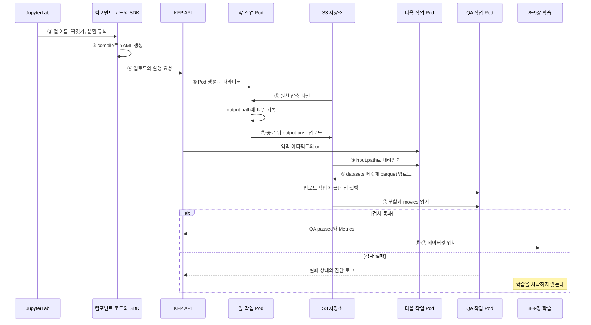
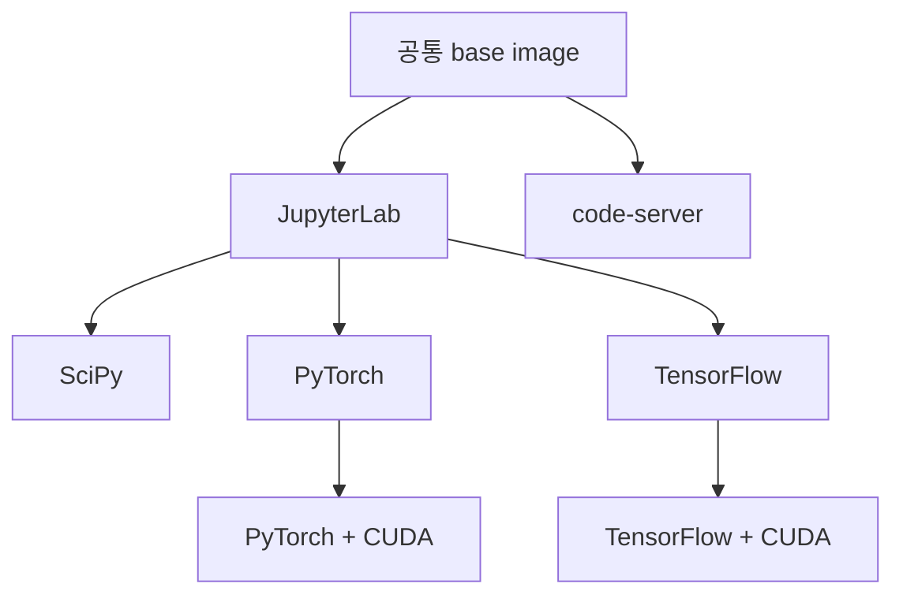
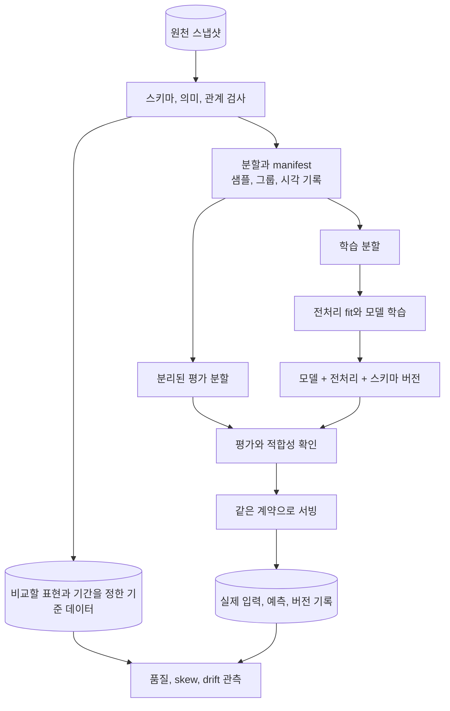

6장에서는 소득 분류 모델을 서비스로 옮기고 입력 변화를 관측했다. 7장부터는 그 플랫폼에 신분증 탐지와 영화 추천이라는 새 프로젝트를 올린다. 새 프로젝트에서 먼저 정할 것은 학습 코드가 아니다. 어떤 데이터가 있는지, 무엇을 예측할지, 어떤 낯선 사례로 평가할지가 먼저다.

이 장은 노트북에서 찾은 처리 규칙을 다음 실행에서도 똑같이 반복되는 준비 파이프라인으로 옮기는 과정이다. 탐색으로 데이터의 의미를 정하고, 컴포넌트 사이의 전달 계약으로 산출물을 잇고, 학습 목적에 맞는 품질 검사로 쓸 입력을 가려낸다. 세 일은 성공의 기준이 서로 다르다. 파일이 내려받아졌다고 다음 Pod가 읽을 수 있는 것도, 읽힌다고 학습에 맞는 데이터인 것도 아니다.

책은 노트북 설정으로 탐색 환경을, 데이터 전달 예제로 작업 사이의 경계를, 두 프로젝트로 그 경계를 지나는 데이터의 의미를 다룬다. 셋은 [학습, 서빙, 관측에 이어지는 계약](#training-serving-contract)으로 모인다. 이 장이 플랫폼의 어느 구간인지는 [전체 그림](#platform-map)에, 직접 따라 하는 과정은 [실습 순서](/docs/tech/machine-learning-platform-engineering/practice/ch07/#book-ch07-sop)에 있다.

## 전체 그림 {#platform-map}

7장은 새 구성 요소를 설치하지 않는다. 4~6장에서 만든 KFP, S3 저장소, MLflow, Feast, 서빙과 관측 도구 사이에서 **다음 단계가 믿고 읽을 데이터셋을 만드는 구간**을 채운다. 7장이 채우는 부분은 파란 상자이고, 8장 이후에 이 데이터를 쓰는 부분은 점선이다.


```mermaid
flowchart LR
    accTitle: 7장 데이터 준비가 놓이는 플랫폼 전체 그림
    accDescr: 개발자 PC의 노트북에서 찾은 규칙을 컴포넌트 코드로 옮기고 KFP SDK로 컴파일해 KFP에 올린다. KFP 작업 Pod는 원천을 내려받아 mlpipeline 버킷의 아티팩트와 datasets 버킷의 분할 파일을 남기고 QA를 실행한다. 8장과 9장의 학습은 이 데이터를 읽어 MLflow에 모델을 등록하고, 10장의 BentoML과 Yatai 서빙, 11장의 Evidently 관측이 그 뒤를 잇는다. 파란 상자는 7장, 회색은 앞 장, 주황 점선은 다음 장의 범위다.
    SRC["원천<br/>GroupLens ZIP<br/>신분증 압축 파일"]
    USER["서비스 요청"]
    subgraph PC["개발자 PC"]
        NB["JupyterLab<br/>탐색 노트북"]
        CODE["컴포넌트 코드<br/>@dsl.component"]
        SDK["KFP SDK<br/>compile"]
        BCLI["bentoml CLI<br/>build"]
    end
    subgraph KF["kind 클러스터: kubeflow 네임스페이스"]
        API["KFP UI와 API"]
        POD["작업 Pod<br/>다운로드, 변환, 분할"]
        QA["QA 작업 Pod"]
        MLP[("S3 mlpipeline<br/>KFP 아티팩트")]
        DS[("S3 datasets<br/>업무용 데이터셋")]
        TRAIN["8~9장 학습 작업 Pod"]
    end
    subgraph MLFNS["mlflow"]
        TRK["Tracking과<br/>Model Registry"]
        PG[("Postgres<br/>메타데이터")]
        MART[("S3 mlflow-artifacts")]
    end
    subgraph RDNS["redis"]
        FEAST[("Feast online store")]
        FREG[("S3 feature-registry<br/>Feast registry")]
    end
    subgraph SVNS["yatai-system / 서빙 네임스페이스"]
        YAT["Yatai: Bento 저장소,<br/>이미지 빌더, BentoDeployment<br/>대안: Deployment와 Service"]
        SPOD["10장 서빙 Pod<br/>API 서버와 Runner"]
    end
    subgraph OBS["관측"]
        EVI["Evidently<br/>보고서와 workspace"]
        DRIFT["11장 drift 점검 작업"]
    end
    SRC -->|"① 표본 파일"| NB
    NB -->|"② 열 이름, 짝짓기, 분할 규칙"| CODE
    CODE -->|"③ 파이프라인 함수"| SDK
    SDK -->|"④ 파이프라인 YAML"| API
    API -->|"⑤ 파라미터 seed, dataset"| POD
    SRC -->|"⑥ 원천 압축 파일"| POD
    POD -->|"⑦ Output .path 기록, .uri로 저장"| MLP
    MLP -->|"⑧ 다음 작업의 Input .path"| POD
    POD -->|"⑨ train, val, test parquet"| DS
    DS -->|"⑩ 업로드된 분할과 movies"| QA
    MLP -.->|"⑪ YOLO 분할 아티팩트"| TRAIN
    DS -.->|"⑫ parquet 데이터셋 URI"| TRAIN
    TRAIN -.->|"⑬ 모델, run_id, 데이터 버전"| TRK
    TRK --- PG
    TRK --- MART
    TRK -.->|"⑭ 등록 모델 버전"| BCLI
    BCLI -.->|"⑮ Bento 태그"| YAT
    YAT -.->|"⑯ 컨테이너 이미지"| SPOD
    USER -.->|"⑰ 요청 user_id"| SPOD
    FREG --- FEAST
    FEAST -.->|"⑱ 온라인 피처"| SPOD
    SPOD -.->|"⑲ 현재 입력 윈도우"| DRIFT
    DS -.->|"⑳ 준비 단계의 기준 분포"| DRIFT
    DRIFT -.-> EVI
    classDef thisch fill:#e8f1ff,stroke:#2f6fd6,stroke-width:2px;
    classDef prev fill:#f3f3f3,stroke:#999;
    classDef next fill:#fff6e5,stroke:#d08a00,stroke-dasharray:4 3;
    class NB,CODE,SDK,POD,QA,MLP,DS thisch
    class API,TRK,PG,MART,FEAST,FREG,YAT,EVI prev
    class TRAIN,BCLI,SPOD,DRIFT,USER next
```

| 번호 | 누가 | 무엇을 넘기는가 | 어디에 남는가 | 실습 단계 |
| --- | --- | --- | --- | --- |
| ① | 원천에서 노트북으로 | `ml-latest-small` CSV, 합성 신분증 이미지와 라벨 | PC의 `data` 폴더 | A-3 |
| ② | 노트북에서 컴포넌트 코드로 | `userId`, `movieId` 열 이름, stem 짝짓기, clip 단위 분할 규칙 | 탐색 노트북과 `ch07\*.py` | A-4 |
| ③ | 컴포넌트 코드에서 SDK로 | `@dsl.component`와 `@dsl.pipeline` 함수 | PC의 Python 파일 | B-1 |
| ④ | SDK에서 KFP로 | 컴파일한 파이프라인 YAML | KFP의 파이프라인과 버전 | B-2 |
| ⑤ | KFP에서 작업 Pod로 | `random_state`, `dataset`, 버킷 이름 같은 파라미터 | 실행 기록의 Input Parameters | B-3 |
| ⑥ | 원천에서 작업 Pod로 | GroupLens ZIP, `ch07-raw`의 합성 압축 파일 | 다운로드 작업의 출력 아티팩트 | C-1, D-3 |
| ⑦ | 작업 Pod에서 KFP 아티팩트로 | `output.path`에 쓴 파일과 폴더 | `mlpipeline/v2/artifacts/...`의 `.uri` | B-4, C-3 |
| ⑧ | KFP 아티팩트에서 다음 작업으로 | 앞 작업의 `.uri`를 내려받은 `input.path` | 다음 Pod의 `/minio/mlpipeline/...` | B-4, C-2 |
| ⑨ | 작업 Pod에서 업무용 버킷으로 | train, val, test와 movies parquet | `datasets/ml-latest-small/` | D-3 |
| ⑩ | 업무용 버킷에서 QA로 | 업로드된 네 파일 | QA 로그와 Metrics 아티팩트 | C-3, D-4 |
| ⑪ | KFP 아티팩트에서 학습으로 | YOLO 구조의 train, validation, test 폴더 | 8장 학습 작업의 입력 | 8장 |
| ⑫ | 업무용 버킷에서 학습으로 | `s3://datasets/...` parquet 위치 | 9장 학습 작업의 입력 | 9장 |
| ⑬ | 학습에서 MLflow로 | 모델, `run_id`, 데이터 버전과 지표 | Postgres 메타데이터, `mlflow-artifacts` | 8~9장 |
| ⑭ | MLflow에서 BentoML로 | 등록 모델 버전 | 로컬 Bento 저장소 | 10장 |
| ⑮ | BentoML에서 Yatai로 | Bento 태그 | Yatai의 Bento 저장소 | 6장, 10장 |
| ⑯ | Yatai에서 서빙 Pod로 | 컨테이너 이미지와 BentoDeployment | Deployment와 Service | 6장, 10장 |
| ⑰ | 사용자에서 서빙 Pod로 | 추천할 `user_id` 또는 판별할 이미지 | API 요청 로그 | 10장 |
| ⑱ | Feast에서 서빙 Pod로 | 온라인 피처 | Redis | 4장, 6장 |
| ⑲ | 서빙 Pod에서 drift 점검으로 | 현재 입력 윈도우 | 요청 기록 | 11장 |
| ⑳ | 업무용 버킷에서 drift 점검으로 | 7장 QA에서 확인한 기준 분포 | Evidently 보고서 | 11장 |

Yatai 상자의 '대안'은 6장 실습에서 Yatai 대신 컨테이너로 만든 Bento를 kind의 Deployment와 Service로 띄운 경로를 가리킨다. 7장의 실습에서 실제로 돌리는 것은 ①부터 ⑩까지다. ⑪ 이후는 이 결과가 어디로 이어지는지 보여 주려고 함께 그렸다.

핵심 경로만 떼어 보면 다음과 같다. 노트북에서 정한 규칙이 컴포넌트로 굳고, KFP가 Pod 사이에서 아티팩트를 옮기고, QA를 통과한 데이터만 학습으로 넘어간다.


```mermaid
sequenceDiagram
    accTitle: 노트북 탐색에서 학습 가능한 데이터셋까지의 실행 순서
    accDescr: 노트북에서 정한 규칙을 컴포넌트 코드로 옮겨 컴파일하고 KFP에 올린다. 앞 작업 Pod는 output.path에 파일을 쓰고 launcher가 이를 output.uri로 업로드한다. 다음 작업은 같은 uri를 input.path로 받아 처리하고 업무용 버킷에 결과를 올린다. QA가 통과해야 학습이 데이터셋을 읽는다.
    participant N as JupyterLab
    participant C as 컴포넌트 코드와 SDK
    participant K as KFP API
    participant A as 앞 작업 Pod
    participant S as S3 저장소
    participant B as 다음 작업 Pod
    participant Q as QA 작업 Pod
    participant T as 8~9장 학습
    N->>C: ② 열 이름, 짝짓기, 분할 규칙
    C->>C: ③ compile로 YAML 생성
    C->>K: ④ 업로드와 실행 요청
    K->>A: ⑤ Pod 생성과 파라미터
    S->>A: ⑥ 원천 압축 파일
    A->>A: output.path에 파일 기록
    A->>S: ⑦ 종료 뒤 output.uri로 업로드
    K->>B: 입력 아티팩트의 uri
    S->>B: ⑧ input.path로 내려받기
    B->>S: ⑨ datasets 버킷에 parquet 업로드
    K->>Q: 업로드 작업이 끝난 뒤 실행
    S->>Q: ⑩ 분할과 movies 읽기
    alt 검사 통과
        Q-->>K: QA passed와 Metrics
        S-->>T: ⑪ ⑫ 데이터셋 위치
    else 검사 실패
        Q-->>K: 실패 상태와 진단 로그
        Note over T: 학습을 시작하지 않는다
    end
```

## 노트북에서 데이터의 의미와 처리 규칙을 찾는다 {#notebook-concepts}

데이터 분석은 파일을 열어 보고 그래프 몇 장을 그리는 데서 끝나지 않는다. 한 행이나 이미지 한 장이 무엇을 뜻하는지, 정답은 어떻게 만들어졌는지 알아내야 한다. 학습과 평가를 흔들 조건도 이때 찾는다.

| 관점 | 신분증 탐지 | 영화 추천 |
| --- | --- | --- |
| 표본의 단위 | 이미지와 그 안의 문서 객체 | 사용자가 영화에 남긴 평점 |
| 관측 조건 | 촬영 기기, 조명, 배경, 회전과 문서 유형 | 사용자 활동량, 영화 노출과 평가 시점 |
| 정답의 의미 | 클래스와 객체 위치 | 관측된 선호와 평점 |
| 확인할 분포 | 클래스별 수, 박스 크기, 촬영 조건 | 사용자별, 영화별 평점 수, 평점 값과 시간 |
| 누락의 의미 | 라벨 누락인지 객체가 없는 이미지인지 | 보지 않았는지, 봤지만 평가하지 않았는지 |

평점이 비어 있다고 낮은 점수를 준 것은 아니다. 라벨 없는 이미지도 진짜 배경 사진인지, 주석이 빠진 것인지에 따라 다르게 다뤄야 한다. 결측이나 빈 파일을 0으로 채우기 전에 그 빈칸이 무슨 뜻인지부터 정한다.

탐색에서 정한 정규화, 결측 대체, 범주 사전은 학습 데이터로만 fit하고, 다른 분할에는 그 변환을 그대로 적용한다. 전체 데이터로 통계를 낸 뒤 나누면 검증과 테스트의 정보가 학습에 새어 들어갈 수 있다.

### 자유롭게 탐색하되 실행 조건은 다시 만들 수 있어야 한다

큰 자료를 PC로 계속 복사하면 전송 시간과 저장 공간이 든다. PC에 없는 GPU나 메모리는 쓸 수도 없다. Kubeflow Notebooks에서는 개발자가 브라우저로 작업하고, 실제 분석은 데이터와 가까운 클러스터에서 돈다.

공유 클러스터에서 각자 원하는 환경을 끝없이 띄울 수는 없다. 관리자가 쓸 수 있는 이미지와 자원 범위를 정하고, 개발자는 그 안에서 작업에 맞는 환경을 고른다. 같은 클러스터에 있다고 원천 데이터 권한이 생기거나 파이프라인과 환경이 저절로 맞춰지지도 않는다.

책이 workspace, data volume, PodDefault, 이미지 메뉴를 차례로 다루는 것도 이 조건을 하나씩 정하기 위해서다. 볼륨은 무엇을 남기고 공유할지, PodDefault는 어떤 공통 설정을 넣을지, 이미지는 어떤 의존성으로 실행할지를 정한다. 탐색을 묶어 두려는 장치라기보다, 탐색에서 얻은 결과를 다른 실행으로 넘기기 위한 바탕이다.

사용자가 Notebook을 만들면 Kubeflow의 제어기가 거기 적힌 이미지, 자원, 볼륨을 실제 워크로드로 띄운다. Notebook 리소스는 원하는 구성을 적은 선언이다. 브라우저 요청을 받는 것은 그 구성으로 뜬 서버다.


```mermaid
flowchart LR
    accTitle: Kubeflow Notebook의 선언과 실행 상태
    accDescr: 사용자는 노트북 UI에서 이미지, 자원과 볼륨을 고른다. Notebook 리소스의 구성을 제어기가 워크로드로 반영하고 브라우저는 실행된 노트북 서버에 접속한다. 영속 데이터는 Pod의 메모리가 아니라 연결한 저장소에 남는다.
    U["사용자와 노트북 UI"] --> N["Notebook 리소스<br/>이미지, 자원, 볼륨 선언"]
    N --> C["Notebook Controller"]
    C --> P["Notebook 서버 Pod"]
    B["브라우저"] -->|"서비스와 접속 경로"| P
    P --> V[("Workspace와 data volume")]
    P --> S[("데이터 저장소")]
```

커널 메모리, Pod의 임시 파일, 영속 볼륨은 수명이 저마다 다르다. Pod가 바뀌면 메모리의 DataFrame은 사라지고, PVC로 연결한 파일은 볼륨과 보존 정책에 따라 남을 수 있다. 노트북 파일이 남았다고 셀을 실행한 상태까지 돌아오지는 않는다.

### 이미지 계층과 개발 환경의 재현성

노트북 이미지는 층을 쌓은 구조다. OS와 시스템 라이브러리 위에 노트북 서버, ML 라이브러리, 프로젝트 의존성이 차례로 올라간다. GPU를 쓰려면 CUDA 같은 실행 조건도 맞춰야 한다.


```mermaid
flowchart TD
    accTitle: Kubeflow 공식 노트북 이미지의 계층
    accDescr: 공통 base image에서 JupyterLab과 code-server가 나뉜다. JupyterLab 위에 SciPy, PyTorch, TensorFlow 환경을 만들고 필요한 경우 CUDA를 포함한 이미지를 선택한다.
    BASE["공통 base image"] --> JUP["JupyterLab"]
    BASE --> CODE["code-server"]
    JUP --> SCI["SciPy"]
    JUP --> PT["PyTorch"]
    JUP --> TF["TensorFlow"]
    PT --> PTGPU["PyTorch + CUDA"]
    TF --> TFGPU["TensorFlow + CUDA"]
```

그림 7-1. 공통 기반에서 개발 서버와 ML 환경이 나뉘는 이미지 계층. 출처: [Kubeflow Container Images](https://github.com/kubeflow/website/blob/796db696b45fd48ef5fe0ab20e82217a322529b2/content/en/docs/components/notebooks/container-images.md), [CC BY 4.0](https://creativecommons.org/licenses/by/4.0/). 공식 도식의 일부 계층을 골라 재구성했다.

| 계층 | 포함하는 것 | 관리 이유 |
| --- | --- | --- |
| 기본 OS와 런타임 | Python, 시스템 라이브러리와 필요한 GPU 런타임 | 네이티브 의존성과 실행 기반 |
| 노트북 서버 | JupyterLab 같은 브라우저 개발 환경 | 서버 시작, 접속과 작업 사용자 구성 |
| 공통 ML 환경 | 데이터 처리와 학습 라이브러리 | 팀에서 함께 쓰는 의존성 |
| 프로젝트 환경 | 추가 패키지와 설정 | 특정 분석과 전처리 코드의 요구사항 |
| 외부 데이터와 작업 볼륨 | 원천 데이터, 노트북과 결과 | 이미지와 분리한 영속성과 버전 관리 |

셀에서 패키지를 설치해도 이미지에는 남지 않는다. 같은 환경을 다시 만들려면 의존성 선언과 이미지 빌드 기록이 있어야 한다. 이미지 생성, 검사, 레지스트리 게시를 CI/CD에 넣어 두면 공통 환경을 몇 번이고 다시 준비할 수 있다.

탐색 이미지와 파이프라인 이미지는 기반을 공유해도 되지만 꼭 같을 필요는 없다. 파이프라인에는 노트북 UI가 필요 없을 수도 있다. 맞춰야 하는 것은 전처리와 실행에 쓰는 의존성과 그 버전이다.

### 자원, PodDefault와 관리자가 제공하는 선택지

CPU와 메모리의 requests는 스케줄링에 쓰는 요구량이고, limits는 실행 중 넘을 수 없는 한도다. 큰 파일을 통째로 메모리에 읽으면 노트북이 멀쩡히 떠 있다가도 한도에 걸려 종료될 수 있다. GPU는 고르는 것만으로 부족하다. 그 자원이 있는 노드와 맞는 이미지도 있어야 한다.

Affinity는 어느 노드에 놓을지에 대한 조건이나 선호를 적고, toleration은 특정 taint를 허용한다고 적는다. PodDefault는 조건에 맞는 Pod에 공통 환경 변수나 볼륨을 넣어 주는 Kubeflow 설정이다. 셋 다 배치와 설정을 다룰 뿐, 데이터 접근 권한이나 올바른 전처리까지 책임지지는 않는다.

책은 관리자가 노트북 웹 앱의 이미지 목록과 자원 기본값을 고치는 부분도 다룬다. 메뉴에 선택지를 두는 일과 실제 Pod에 들어가는 설정은 따로 봐야 한다. 플랫폼은 사용자에게 필요한 환경을 내주면서 클러스터 용량, 작업 보존, 유휴 종료도 함께 관리한다.

## 탐색 규칙을 컴포넌트의 입력과 출력으로 고정한다 {#pipeline-data-concepts}

탐색 환경과 원본이 준비되면 다운로드, 변환, 분할을 반복 실행할 작업으로 옮긴다. 노트북 셀은 메모리를 공유하지만 파이프라인의 작업은 그렇지 않다. 입력, 출력, 실행 환경을 명시해서 이어야 한다. 파일을 만든 작업이 성공했는지와 다음 작업이 그 파일을 읽을 수 있는지는 따로 확인할 일이다.

### 탐색 코드를 컴포넌트로 바꾸는 이유

노트북은 셀 실행 순서와 앞서 남은 메모리 상태에 기대기 쉽다. 컴포넌트는 입력, 출력, 실행 환경을 인터페이스로 못 박는다. 그래서 필요한 작업만 다시 돌릴 수 있고 다른 파이프라인에서도 가져다 쓸 수 있다.

파이프라인 정의는 이 컴포넌트들의 의존 관계를 조립한다. Python 코드를 컴파일하는 순간에는 데이터를 받지도, 학습하지도 않는다. 실행 명세가 만들어질 뿐이고, 실제 입력 값과 파일 경로는 작업이 돌 때 정해진다.

책의 농담 생성, 단어 수 세기, 결과 출력 예제는 ML 알고리즘을 가르치려는 것이 아니다. 메모리를 공유하지 않는 세 작업을 어떻게 잇는지 작은 데이터로 보여 준다. 처음에는 농담 문자열을 값으로 넘기고, 다음 예제에서는 농담을 파일에 써서 아티팩트로 넘긴다. 뒤에서 이미지 묶음과 평점 파일을 잇는 원리가 바로 이 차이다.

### 세 가지 컴포넌트 작성 방식

| 방식 | 코드와 의존성 준비 | 적합한 상황 |
| --- | --- | --- |
| Lightweight Python component | 함수 코드를 추출하고 `base_image`, `packages_to_install`로 실행 환경 구성 | 작고 독립적인 Python 처리 |
| Containerized Python component | Python 컴포넌트 코드와 의존성을 `target_image` 대상으로 미리 빌드 | 반복 설치를 줄이고 실행 환경을 고정할 때 |
| Container component | 준비된 이미지의 실행 명령과 인자를 `ContainerSpec`으로 연결 | 별도 프로그램, 시스템 의존성이나 복잡한 실행 구조 |

Lightweight 컴포넌트는 개발 PC의 가상환경을 통째로 가져가지 않는다. 필요한 모듈은 함수 안에서 import하고, 그 의존성은 실행 이미지에 있어야 한다. 바깥 셀의 변수나 옆의 Python 파일이 함께 실려 간다고 가정하면 안 된다.

`packages_to_install`은 작업이 시작될 때 패키지를 설치해 주니 간단하다. 대신 네트워크와 설치 시간이 실행 조건에 끼어든다. 미리 빌드한 이미지는 시작 시 설치를 줄이지만, 이미지를 빌드하고 갱신하는 일이 새로 생긴다. `target_image`를 적거나 YAML을 컴파일했다고 그 이미지가 빌드되거나 게시되지는 않는다.

### 값 전달과 파일 전달

KFP는 작은 설정과 결과는 파라미터로, 데이터셋과 모델 같은 산출물은 아티팩트로 나눈다.

| 구분 | 파라미터 | 아티팩트 |
| --- | --- | --- |
| 의미 | 작은 값의 전달 | 파일 내용과 산출물 식별 정보의 전달 |
| 예 | seed, 버킷 이름, 행 수, 작은 설정 목록 | 이미지 묶음, Parquet, 모델과 보고서 |
| 인터페이스 | `str`, `int`, `float`, `bool` 등 지원 타입 | `Input[Dataset]`, `Output[Model]` 등 |
| 전달 내용 | 직렬화된 값 | URI, 메타데이터와 실행 시 사용할 경로 |
| 책임 | 값의 형식과 의미 정의 | 선언한 출력에 파일 작성, 내용의 검증 |

저장소 URI를 문자열 파라미터로 넘길 수도 있다. 그러면 파일을 읽고 권한과 버전을 확인하는 일은 코드 몫이 된다. 경로처럼 생긴 문자열이라고 KFP가 파일 아티팩트로 추적해 주지는 않는다.

KFP 아티팩트에는 세 가지가 붙는다. `.uri`는 저장 위치이고, `.path`는 작업 안에서 읽고 쓸 로컬 경로이며, `.metadata`에는 부가 정보를 남길 수 있다. 출력 아티팩트는 받은 경로에 내용을 써야 한다. 다른 폴더에 만든 파일까지 알아서 모아 주지는 않는다.

다운로드 컴포넌트가 `output_dataset.path`에 파일을 쓰면, 다음 컴포넌트는 자기 `input_dataset.path`에서 그 산출물을 읽는다. 두 Pod의 경로 문자열은 달라도 된다. 같아야 하는 것은 전달되는 파일의 내용과 구조다. 컴포넌트를 호출할 때 출력 경로를 넘기지 않아도 되는 것은 런타임이 출력 아티팩트와 경로를 마련해 주기 때문이다.

책은 파일 경로, MinIO 위치, 아티팩트를 오가며 설명한다. 이때 가려 볼 것은 하나다. 경로가 가리키는 내용이 실제 데이터인가, 다른 저장소를 가리키는 참조인가. 파일 내용이 URI 한 줄이면 다음 코드는 그 URI를 읽어 데이터를 다시 가져와야 한다. 압축을 푼 데이터 자체를 썼다면 다음 코드는 그 디렉터리 구조를 읽는다. `Output[Dataset]`으로 선언했다고 두 경우가 같아지지는 않는다.

경로로 넘긴다고 큰 데이터를 옮기는 비용이 사라지지도 않는다. 제어 메시지에 데이터를 싣지 않을 뿐, 실제 파일은 저장소와 작업 사이를 오간다. 읽을 열과 묶음을 줄이거나 원격 자료를 직접 읽는 것은 별개의 전략이다. 아티팩트 전달이 메모리 초과를 막아 주지는 않는다.


그림 7-2. 파이프라인 정의와 작업 아티팩트의 객체 저장소 설정. 출처: [Kubeflow 공식 도식](https://github.com/kubeflow/website/blob/796db696b45fd48ef5fe0ab20e82217a322529b2/content/en/docs/components/pipelines/operator-guides/images/kfp-obj-store-configurations.png), [CC BY 4.0](https://creativecommons.org/licenses/by/4.0/). 원본 도식을 변경 없이 사용했다.

그림에서 파이프라인 정의를 저장하는 API 서버와, 실제 산출물을 읽고 쓰는 작업 쪽 설정은 서로 다른 지점이다. 한 Pod 안의 경로가 다른 Pod에서 그대로 보이는 것은 아니다. 둘 사이를 잇는 것은 아티팩트 저장소와 실행 설정이다.

### 아티팩트 타입과 lineage

| 타입 | 표현하는 산출물 |
| --- | --- |
| `Dataset` | 학습과 검증 등에 사용할 데이터 |
| `Model` | 학습한 모델 파일과 관련 정보 |
| `Metrics` | 이름과 수치로 된 평가 결과 |
| `ClassificationMetrics` | 혼동행렬 등 분류 평가 정보 |
| `HTML`, `Markdown` | 사람이 읽을 보고서 |
| `Artifact` | 더 구체적인 타입으로 표현하지 않은 일반 산출물 |


그림 7-3. KFP 공식 예제의 평가 지표 비교 화면. 출처: [Kubeflow run comparison 이미지](https://github.com/kubeflow/website/blob/796db696b45fd48ef5fe0ab20e82217a322529b2/content/en/docs/images/pipelines/v2/run-comparison/scalar-metrics.png), [CC BY 4.0](https://creativecommons.org/licenses/by/4.0/). 이 글의 탐지나 추천 모델에서 측정한 점수가 아니다.

타입은 컴포넌트 연결 검사, 결과 표시, 산출물 이력에 쓰인다. 여러 작업이 같은 이름의 파일을 만들어도 어느 실행이 어떤 입력으로 만들었는지 가려낼 수 있다. KFP는 이런 입출력 관계를 메타데이터로 관리한다.

하지만 `Dataset` 타입이 열 이름이나 평점 범위를 검사해 주지는 않는다. 모델을 만든 데이터를 추적할 수 있다는 것과 그 데이터가 적합하다는 것은 다른 이야기다. 스키마와 도메인 검사는 따로 써야 한다.

### 캐시, 외부 상태와 실행 비용

컴포넌트를 나누면 중간 결과를 재사용할 수 있다. 그런데 같은 URI의 파일 내용이 바뀌어도 입력 식별자에 반영되지 않으면 오래된 결과를 쓰게 된다. 원천 checksum이나 스냅샷을 입력으로 남기고, 재사용해도 되는 작업과 매번 돌릴 작업을 나눈다.

캐시를 모두 끄면 다운로드와 변환을 매번 반복한다. 컴포넌트를 너무 잘게 쪼개면 Pod 시작과 파일 이동 비용도 커진다. 재사용, 자원, 실패와 재시도의 단위가 달라지는 지점에서 나누는 편이 낫다.

## 모델이 배울 관계에 맞춰 데이터와 분할을 검증한다 {#dataset-concepts}

전달 경로가 이어져도 산출물 내용이 맞는지는 별개의 문제다. 이미지에서는 대상의 위치와 라벨이, 평점에서는 사용자와 영화의 관계가 학습 입력이 된다. 책은 비슷한 다운로드와 분할을 두 번 보여 주지만, 탐지는 이미지와 위치 라벨의 대응을, 추천은 사용자, 영화, 관측 시점의 관계를 지켜야 한다. 공통 컴포넌트는 재사용하더라도 도메인 검사를 따로 두는 이유다.

### 탐지 데이터는 이미지와 위치 라벨이 한 표본이다

객체 탐지는 이미지 안에 무엇이 어디에 있는지 배운다. 이미지 전체에 라벨 하나를 붙이는 분류와도, 픽셀마다 영역을 정답으로 주는 분할과도 다르다. 이 장의 YOLO 데이터에서는 클래스와 bounding box의 조합이 핵심이다.

YOLO 형식에서 객체 하나는 `class_id x_center y_center width height` 한 행이다. 클래스 ID는 클래스 목록과 이어지고, 좌표는 이미지 크기로 정규화한다.

```text
이미지 크기: W, H
픽셀 박스: (x_min, y_min), (x_max, y_max)

x_center = (x_min + x_max) / (2 * W)
y_center = (y_min + y_max) / (2 * H)
width    = (x_max - x_min) / W
height   = (y_max - y_min) / H
```

객체가 여러 개면 라벨도 여러 행이다. 원천이 문서의 네 꼭짓점을 준다면 축에 맞춘 박스로 바꿀지, 회전 박스를 쓸지부터 정한다. 주석 형식이 다른 좌표를 그대로 옮기면 같은 데이터가 되지 않는다.

책의 프로젝트는 이미 YOLO 형식으로 정리된 배포 데이터를 전제로 한다. 다운로드와 분할 컴포넌트가 원천 주석을 변환해 주는 것은 아니다. 그래서 같은 stem의 이미지와 라벨, 클래스 매핑, 좌표 의미를 먼저 확인해야 한다. 파일 수가 맞아도 엉뚱한 이미지의 라벨과 짝지어지면, 작업은 성공하고 정답만 틀린다.

### 추천 데이터는 사용자와 영화 사이의 관측된 관계다

추천은 사용자와 아이템 사이에 관측된 상호작용을 다룬다. MovieLens 평점은 사용자가 직접 남긴 명시적 피드백이다. 클릭이나 시청 기록에서 추정하는 암묵적 피드백과는 성격이 다르다. 관측되지 않은 사용자와 영화 조합을 모두 낮은 평점의 정답으로 만들 수는 없다.

사용자 ID와 영화 ID는 조인과 모델 입력의 키다. 파일끼리의 일관성과 모델이 쓰는 ID 매핑을 지켜야 한다. 원천 ID의 최대값이 곧 서로 다른 ID의 개수라고 볼 수도 없다.

### CSV, Parquet과 데이터 규모

CSV는 사람이 보기 쉽지만 값의 타입, 구분자, 인코딩을 따로 정해야 한다. Parquet은 타입을 가진 열 단위 형식이라 압축과 필요한 열만 읽기에 유리하다. 형식 변환은 물리적 표현을 바꿀 뿐, 잘못된 값이나 중복을 고치지는 않는다.

Parquet을 써도 DataFrame 전체를 메모리에 올리는 코드라면 한계는 그대로다. 코드가 전체를 읽는지, 필요한 열만 읽는지, 묶음으로 처리하는지를 Pod의 메모리 요구와 함께 봐야 한다.

MovieLens 예제가 다운로드, 압축 해제, Parquet 변환, 업로드를 나눈 것은 데이터 준비의 책임을 보여 주기 위해서다. 영화와 평점 변환에 같은 컴포넌트를 재사용할 수 있지만, 모든 변환을 별도 Pod로 둬야 한다는 설계 규칙은 아니다. 책도 실제 운영에서는 데이터 이동 비용 때문에 일부 작업을 합칠 수 있다고 말한다.

MovieLens의 `ratings.csv`에는 `userId`, `movieId`, `rating`, `timestamp`가 있다. [원천 설명](https://files.grouplens.org/datasets/movielens/ml-25m-README.html)에 따르면 평점은 0.5~5.0의 반점 단위이고 timestamp는 UTC 기준 Unix 초다. 시간 기준과 값의 범위도 스키마에 들어간다.

### 분할은 평가하려는 상황을 만드는 작업

| 분할 | 주된 용도 | 다른 분할과 구분할 일 |
| --- | --- | --- |
| 학습 | 모델과 전처리의 파라미터 학습 | 학습에 사용한 통계와 사전 기록 |
| 검증 | 설정과 후보 선택, 개발 중 평가 | 선택 과정의 영향을 받는다는 점 인식 |
| 테스트 | 선택을 마친 뒤 독립적인 최종 평가 | 반복 확인하며 모델을 고르는 자료로 쓰지 않음 |

무작위 분할은 표본이 서로 충분히 독립이라는 가정에서 출발한다. 같은 영상의 프레임이나 같은 문서를 여러 번 찍은 사진은 독립 표본으로 보기 어렵다. 처음 보는 문서에서의 성능을 알고 싶다면 문서나 영상 단위로 나누는 편이 맞을 수 있다.

추천에서 미래 행동을 예측하려면 시간이 중요하다. 과거 기록으로 학습하고 이후 행동으로 평가하는 것과, 같은 시기의 평점 일부를 가려 놓고 맞히는 것은 다른 문제다. 신규 사용자와 신규 영화의 cold start도 따로 봐야 한다.

시드를 고정하면 정해진 절차의 무작위성만 통제된다. 평가 설계가 잘못됐다면 그 잘못은 그대로 남는다. 분할 비율보다 어떤 표본과 시간이 경계를 넘으면 안 되는지를 먼저 정한다.

그래서 책의 75/15/10 분할은 파일을 세 산출물로 나누는 예제로 읽는 것이 맞다. 모든 탐지와 추천 서비스에 맞는 답은 아니다. 같은 문서의 비슷한 사진이 여러 분할에 흩어지거나 미래 평점이 과거 학습에 섞이면, 평가가 실제보다 쉬워진다. 서비스가 처음 마주칠 대상과 시점을 정하고 거기에 맞춰 나눈다.

### 품질 검사와 재현 가능한 데이터 준비

데이터 준비는 다운로드, 파싱, 변환, 분할, 저장, QA가 이어진 사슬이다. 각 단계가 성공해도 다음 단계가 원하는 데이터인지는 검사해 봐야 안다.

| 검사 계층 | 예 |
| --- | --- |
| 파일과 저장소 | 다운로드 성공, 압축 형식, 필요한 객체 존재 |
| 스키마 | 열 이름과 타입, 이미지와 라벨의 형식, 좌표 단위 |
| 의미와 관계 | 평점 범위, ID 조인, 이미지와 라벨의 대응 |
| 분할과 누수 | 같은 원천 그룹과 미래 정보의 혼입 여부 |
| 계보와 버전 | 원천 checksum, 변환 코드, 분할 기준과 결과 위치 |

로그는 어느 단계가 실패했는지 찾는 데 쓰고, QA는 넘기면 안 되는 입력을 걸러 낸다. 데이터를 통째로 로그에 찍는 것과 재현 가능한 진단 정보를 남기는 것은 다르다. 원천 식별자, 행과 파일 수, 스키마, 실패 유형만 남겨도 데이터를 다 출력하지 않고 조사 범위를 좁힐 수 있다.

책의 파일 목록 출력과 MovieLens QA는 이런 검증의 출발점이다. 고정한 원본 코드의 train QA는 열 수와 최소 행 수만 본다. 평점 범위, ID 관계, 다른 분할은 아직 검사하지 않는다. **파이프라인의 초록색 성공 표시는 구현한 작업이 끝났다는 뜻일 뿐, 구현하지 않은 데이터 조건까지 보증하지 않는다.**

이 구분이 필요한 까닭은 데이터 오류가 꼭 학습 실패로 드러나지는 않아서다. 이미지와 라벨이 어긋나거나 미래 평점이 섞여도 학습은 잘 돈다. 준비 단계에서 기대 조건을 적고 검사해야, 나중에 나온 점수가 무엇을 평가한 결과인지 설명할 수 있다.

## 데이터 준비와 서빙을 잇는 계약 {#training-serving-contract}

이 검증 기준은 학습 한 번으로 쓰임이 끝나지 않는다. 6장에서 본 API와 관측 작업도 같은 의미의 피처와 버전을 알아야 한다. 원천에서 만든 데이터셋, 학습 때 fit한 전처리, 서비스 입력을 이어 두어야 변환 오류와 실제 분포 변화를 가를 수 있다.

### 원천 파일에서 모델 입력까지 무엇이 바뀌는가

준비 단계의 출력은 학습 코드만 읽는 파일이 아니다. 서비스는 같은 의미의 입력을 만들고, 관측 작업은 그 입력을 맞는 기준과 비교해야 한다.


```mermaid
flowchart TD
    accTitle: 데이터 준비에서 학습, 서빙과 관측으로 이어지는 계약
    accDescr: 원천 스냅샷을 스키마와 의미 규칙으로 검증하고 분할 이력을 남긴다. 학습 데이터로 fit한 전처리는 모델과 함께 버전으로 관리한다. 서빙은 호환되는 계약을 사용하고 실제 입력을 기록한다. 모니터링은 같은 표현의 기준 데이터와 서빙 입력을 비교한다.
    RAW[("원천 스냅샷")] --> QA["스키마, 의미, 관계 검사"]
    QA --> SPLIT["분할과 manifest<br/>샘플, 그룹, 시각 기록"]
    SPLIT --> TRAIN["학습 분할"]
    SPLIT --> EVAL["분리된 평가 분할"]
    TRAIN --> FIT["전처리 fit와 모델 학습"]
    FIT --> BUNDLE["모델 + 전처리 + 스키마 버전"]
    EVAL --> CHECK["평가와 적합성 확인"]
    BUNDLE --> CHECK
    CHECK --> SERVE["같은 계약으로 서빙"]
    QA --> REF[("비교할 표현과 기간을 정한 기준 데이터")]
    SERVE --> LOG[("실제 입력, 예측, 버전 기록")]
    REF --> MON["품질, skew, drift 관측"]
    LOG --> MON
```

그림은 계약을 지키기 위한 참조 구조다. 저자 코드가 이 산출물을 모두 자동으로 등록해 주는 것은 아니다. 남겨 둘 버전은 종류별로 나눠 볼 수 있다.

| 산출물 | 다음 단계에 필요한 정보 |
| --- | --- |
| 원천 스냅샷 | 출처, 수집 시각과 내용의 식별자 |
| 스키마와 의미 규칙 | 열과 타입, 좌표, 시간, 평점의 단위와 허용 범위 |
| 분할 manifest | 어느 샘플, 그룹, 기간을 각 분할에 넣었는지 |
| 변환 코드와 실행 이미지 | 어떤 코드와 의존성으로 데이터를 만들었는지 |
| fit한 전처리 | 범주 사전, 스케일과 결측 대체값이나 ID 매핑 |
| QA 결과 | 검사한 규칙, 실패 항목과 평가 대상 |
| 관측 기준 | 어떤 모델, 표현, 집단과 기간을 비교하는 reference인지 |

`latest` 경로의 파일을 덮어쓰거나 seed 하나만 저장하면 이 관계는 되살리기 어렵다. 다시 찾아야 하는 것은 같은 이름의 파일이 아니라 같은 내용과 처리 과정이다.

### 스키마 위반, training-serving skew와 drift의 차이

[TensorFlow Data Validation](https://www.tensorflow.org/tfx/data_validation/get_started)은 스키마 검증, 학습과 서빙 사이의 skew, 시점이 다른 데이터 사이의 drift를 나눠 다룬다. 이 장의 환경에 TFDV를 넣자는 것은 아니다. 검사 목적을 나눠 보는 예로 빌려 왔다.

| 구분 | 묻는 것 | 예 |
| --- | --- | --- |
| 스키마와 의미 위반 | 이 데이터가 합의한 형식과 값의 조건에 맞는가 | `rating`이 문자열, 좌표 단위 오류, 필수 키 결측 |
| Training-serving skew | 학습과 서비스가 같은 의미의 입력을 만드는가 | 학습은 UTC 초, 서비스는 밀리초를 사용 |
| 시간에 따른 drift | 같은 의미로 측정한 데이터의 분포가 달라졌는가 | 새 사용자 집단 유입으로 선호와 직업 구성이 변화 |

두 분포가 다르다는 관측만으로 원인을 정할 수는 없다. 분포는 사용자 환경이 바뀌어서도, 파싱이나 변환이 틀려서도 달라진다. 계약과 데이터 생성 경로가 같은지부터 확인한다.

학습 데이터에는 정답 열이 있지만 서빙 입력에는 없을 수 있다. 그러니 학습과 서빙이 모든 열을 글자 그대로 공유해야 한다는 규칙도 맞지 않는다. 예상된 차이는 스키마에 적어 두고, 모델이 실제로 쓰는 피처의 계약을 맞춘다.

### 같은 변환과 같은 시점이라는 조건

범주 사전이나 스케일을 학습 때 만들었다면, 추론 때 입력 한 건을 보고 다시 만들지 않는다. fit은 학습 데이터에서 하고, 검증, 테스트, 서빙에는 같은 변환을 적용한다.

| 프로젝트 | 유지할 계약 | 깨졌을 때의 결과 |
| --- | --- | --- |
| 소득 분류 | 범주 인코딩, 열 순서와 피처 최신성 | 같은 열 수라도 다른 의미의 모델 입력 |
| 객체 탐지 | 클래스 매핑, 이미지 전처리와 좌표 정의 | 다른 클래스 해석이나 잘못된 박스 |
| 영화 추천 | 사용자 ID와 영화 ID의 매핑, 사용 가능한 이력의 시점 | 다른 아이템을 가리키거나 미래 행동 혼입 |

이미지 크기 조정이나 픽셀 정규화처럼 학습과 추론 모두에 필요한 전처리가 있고, 학습 자료를 늘리는 augmentation이 있다. 둘은 구분한다. 학습에 쓴 무작위 증강을 평가나 서비스에 똑같이 적용해야 하는 것은 아니다.

피처 저장소를 쓴다면 조회 시점도 계약에 들어간다. 학습 표본의 기준 시각 뒤에야 알려진 값을 붙이거나 과거 이력을 현재 최신값으로 덮어쓰면, 실제 서비스 조건을 재현하지 못한다. 저장소를 두었다고 point-in-time 조건이 지켜지는 것은 아니니 따로 확인한다.

### 준비 단계의 통계가 운영 관측의 기준이 된다

소득 분류 서비스에서 학력과 직업 분포를 지켜보려면 어떤 학습 집단과 피처 정의를 기준으로 삼았는지 알아야 한다. 인코딩 전 범주 분포와 인코딩 후 수치 열은 서로 직접 비교할 수 없다.

추천에서는 사용자 활동량이나 영화별 평점 수가, 탐지에서는 촬영 조건이나 문서 유형의 변화가 조사의 출발점이 될 수 있다. 어떤 집단과 표현을 비교할지 먼저 정하고, 그에 필요한 자료나 통계를 준비 단계에서 남긴다. 표 데이터용 분포 검사를 이미지 픽셀에 그대로 돌린다고 관측 설계가 끝나지는 않는다.

[6장의 관측 구조](/docs/tech/machine-learning-platform-engineering/06-productionizing-models/#production-monitoring)는 이 reference와 서비스의 실제 입력 기록을 잇는다. 사용자 ID만 저장해 두고 나중에 최신 피처를 다시 읽으면, 당시 어떤 값으로 예측했는지 알 길이 없다. 데이터 준비와 운영 관측이 같은 버전과 같은 시간 개념을 써야 하는 이유다.

### 실패를 어디에서 중단할지 정한다

노트북은 탐색을 돕는다. 운영 파이프라인은 언제 실패하고 언제 다시 돌릴지까지 분명해야 한다. 스키마 위반이나 이미지와 라벨의 불일치는 학습 전에 멈출 이유가 될 수 있다. 다운로드의 일시 장애와 달리, 다시 시도한다고 잘못된 데이터가 맞아지지는 않는다.

일부 출력만 남은 실행과 검증을 마친 데이터 묶음도 구분한다. 같은 위치에 덮어쓰는 구성이라면 일부 파일만 새 버전이 되는 일을 막거나, manifest로 일관된 완료 단위를 식별할 수 있어야 한다.

품질 검사를 통과한 데이터로 학습했다고 출시가 승인된 것은 아니다. 데이터 QA, 모델 평가, 서빙 성능, 배포 전환은 이어져 있지만 책임이 다르다. 이 경계가 살아 있어야 6장의 drift 경고가 데이터 수정, 추가 평가, 재학습 중 어디로 이어질지 판단할 수 있다.

결국 7장이 만드는 것은 다운로드가 끝난 폴더가 아니라, 다음 단계가 의미를 알고 읽을 수 있는 데이터셋이다. 아티팩트 전달과 QA를 따로 두는 이유도 여기 있다. 학습이 정상 종료됐다고 입력이 옳았다는 뜻은 아니다. 원천, 라벨, 분할, 버전의 연결이 분명해야 다음 장에서 성능 차이를 모델의 변화로 읽을 수 있고, 서빙에서도 같은 계약을 지킬 수 있다.

## 실습 {#book-ch07-sop}

책 코드로 직접 실행한 순서와 결과 화면은 [7장 실습 기록](/docs/tech/machine-learning-platform-engineering/practice/ch07/)에 따로 모았다.

## 참고 자료

- [TensorFlow Data Validation의 시작 안내](https://www.tensorflow.org/tfx/data_validation/get_started): 통계와 스키마, 이상 데이터 검증, training-serving skew와 drift의 구분.
- [출판사의 7장 개요](https://www.manning.com/preview/machine-learning-platform-engineering/chapter-7): 노트북 환경, 데이터 전달과 컴포넌트 작성 방식, 두 데이터 준비 프로젝트의 범위.
- [Kubeflow 노트북 이미지](https://www.kubeflow.org/docs/components/notebooks/container-images/): 서버 이미지와 ML 프레임워크 이미지의 계층.
- [KFP 데이터 타입](https://www.kubeflow.org/docs/components/pipelines/user-guides/data-handling/data-types/), [아티팩트 전달](https://www.kubeflow.org/docs/components/pipelines/user-guides/data-handling/artifacts/): 타입, 경로와 메타데이터의 역할.
- [YOLO 탐지 데이터 형식](https://docs.ultralytics.com/datasets/detect/): 클래스와 정규화 박스 좌표.
- [MovieLens 25M 데이터 설명](https://files.grouplens.org/datasets/movielens/ml-25m-README.html): 파일 간 ID, 평점과 시간 필드의 의미.
- [Kubeflow Notebooks 개요](https://www.kubeflow.org/docs/components/notebooks/overview/): 클러스터 안에서 실행하는 개발 환경의 범위.
- [객체 탐지 데이터 준비 진입점](https://github.com/practical-mlops/object-detection-project/blob/c6afb114e628e776a76f9ac50b45899aff5e8eaf/data_prep_pipeline.py): 다운로드, 분할과 파일 목록 출력.
- [영화 추천 데이터 준비 파이프라인](https://github.com/practical-mlops/movie-recommender-project/blob/4e0a808e0dca3aef16850cd14df47d2fda9f9bd2/01_data_preparation_pipeline.py): 컴포넌트 연결과 실행 파라미터.
- [영화 데이터 준비 컴포넌트](https://github.com/practical-mlops/movie-recommender-project/blob/4e0a808e0dca3aef16850cd14df47d2fda9f9bd2/data_components/dataset_preparation.py): 변환, 분할, 업로드와 실제 QA 범위.
- [영화 학습 전처리](https://github.com/practical-mlops/movie-recommender-project/blob/4e0a808e0dca3aef16850cd14df47d2fda9f9bd2/training_and_validation_components/data_preprocessing.py): 다음 단계가 기대하는 열과 저장 경로.

[이전: 06. 모델을 프로덕션으로](/docs/tech/machine-learning-platform-engineering/06-productionizing-models/), [시리즈 목차](/docs/tech/machine-learning-platform-engineering/)
