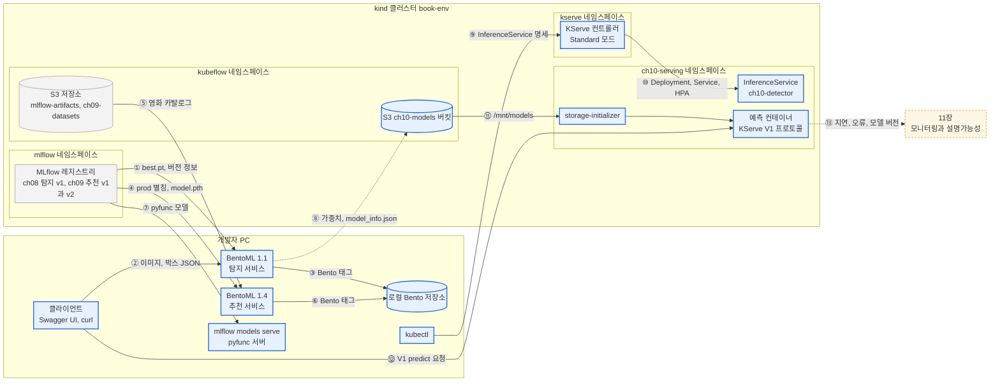
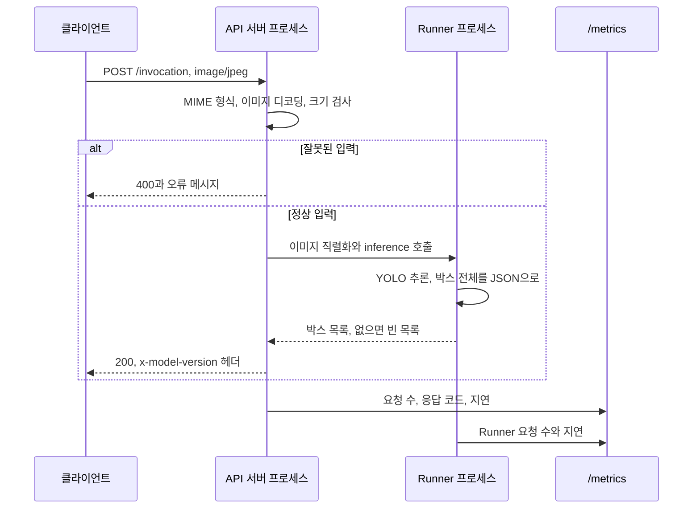

9장까지 손에 쥔 것은 파일이었다. 8장은 `best.pt`를 남겼고, 9장은 MLflow에 `model.pth`와 `staging` 별칭을 남겼다. 파일만으로는 다른 프로그램이 모델을 쓸 수 없다. 누군가 요청을 받아 입력을 검사하고, 모델이 기대하는 모양으로 바꾸고, 약속한 형식으로 답을 돌려줘야 한다.

10장은 그 "누군가"를 만드는 장이다. 책은 BentoML로 탐지 모델을 API로 만들고(10.3~10.5), 이를 MLflow 레지스트리와 연결한다(10.6). MLflow만으로 서빙하는 길도 보여 주고(10.7), Kubernetes 쪽 대안으로 KServe를 소개한다(10.8).

책을 따라가다 보면 세 군데서 걸린다. 하나는 말이다. 모델 파일, 서비스 코드, Bento, 컨테이너 이미지, 배포가 모두 "모델을 배포했다"로 뭉뚱그려져 각각 무엇을 고정하는지 흐려진다. 또 하나는 버전이다. 책은 BentoML 1.1의 Service와 Runner로 설명하다가 추천 서비스 리스팅 10.1에서는 1.2 이후의 클래스 기반 API를 쓴다. 두 코드는 같은 버전으로 함께 돌지 않는다. 마지막은 KServe 절의 예시다. YOLO 모델에 scikit-learn 런타임을 지정하고 있어 그대로는 동작하지 않는다.

앞부분은 구성 요소들이 무엇을 주고받는지, 각 도구가 어디까지 책임지는지를 다룬다. 뒤의 [실습 순서](/docs/tech/machine-learning-platform-engineering/practice/ch10/#book-ch10-sop)는 실제로 돌린 과정과 화면이다. 저자 코드가 지금 그대로 돌지 않는 곳과, 돌기는 하는데 틀린 답을 내는 곳도 함께 적었다. 더 곤란한 쪽은 뒤쪽이다. 200 응답 뒤에 숨어 있어서다.

## 전체 그림 {#platform-map}

10장의 일은 등록된 모델을 요청 경로에 올리는 것이다. 아래 그림은 이번 실습에서 각 구성 요소가 어디서 실행됐고 번호 순서대로 무엇을 넘기는지 보여 준다. 레지스트리와 S3 저장소는 8~9장에서 만든 것이고, 오른쪽 끝의 관측은 11장이 이어받는다.


```mermaid
%%{init: {"flowchart": {"rankSpacing": 25, "nodeSpacing": 18, "padding": 6}}}%%
flowchart LR
    accTitle: 10장 실습에서 모델이 서비스와 배포로 이어지는 경로
    accDescr: MLflow 레지스트리에 있는 8장 탐지 모델과 9장 추천 모델을 개발자 PC가 내려받아 BentoML 1.1 탐지 서비스, BentoML 1.4 추천 서비스, MLflow pyfunc 서버로 실행하고 Bento로 묶는다. 같은 탐지 가중치를 S3 버킷에 복사하면 KServe 컨트롤러가 InferenceService 명세를 Deployment와 Service로 바꾸고, storage-initializer가 가중치를 Pod에 내려받아 예측 컨테이너가 요청을 처리한다. 요청 지표와 로그는 11장의 모니터링으로 이어진다.
    subgraph PC["개발자 PC"]
        CLIENT["클라이언트<br/>Swagger UI, curl"]
        YOLO["BentoML 1.1<br/>탐지 서비스"]
        REC["BentoML 1.4<br/>추천 서비스"]
        MLS["mlflow models serve<br/>pyfunc 서버"]
        BSTORE[("로컬 Bento 저장소")]
        KCTL["kubectl"]
    end
    subgraph KIND["kind 클러스터 book-env"]
        subgraph MLNS["mlflow 네임스페이스"]
            REG["MLflow 레지스트리<br/>ch08 탐지 v1, ch09 추천 v1과 v2"]
        end
        subgraph KFNS["kubeflow 네임스페이스"]
            S3[("S3 저장소<br/>mlflow-artifacts, ch09-datasets")]
            S3M[("S3 ch10-models 버킷")]
        end
        subgraph KSNS["kserve 네임스페이스"]
            KSC["KServe 컨트롤러<br/>Standard 모드"]
        end
        subgraph SVNS["ch10-serving 네임스페이스"]
            ISVC["InferenceService<br/>ch10-detector"]
            INIT["storage-initializer"]
            PRED["예측 컨테이너<br/>KServe V1 프로토콜"]
        end
    end
    NEXT["11장<br/>모니터링과 설명가능성"]

    REG -->|"① best.pt, 버전 정보"| YOLO
    CLIENT -->|"② 이미지, 박스 JSON"| YOLO
    YOLO -->|"③ Bento 태그"| BSTORE
    REG -->|"④ prod 별칭, model.pth"| REC
    S3 -->|"⑤ 영화 카탈로그"| REC
    REC -->|"⑥ Bento 태그"| BSTORE
    REG -->|"⑦ pyfunc 모델"| MLS
    YOLO -.->|"⑧ 가중치, model_info.json"| S3M
    KCTL -->|"⑨ InferenceService 명세"| KSC
    KSC -->|"⑩ Deployment, Service, HPA"| ISVC
    S3M -->|"⑪ /mnt/models"| INIT
    INIT --> PRED
    CLIENT -->|"⑫ V1 predict 요청"| PRED
    PRED -.->|"⑬ 지연, 오류, 모델 버전"| NEXT

    classDef thisch fill:#e8f1ff,stroke:#2f6fd6,stroke-width:2px;
    classDef prev fill:#f3f3f3,stroke:#999;
    classDef next fill:#fff6e5,stroke:#d08a00,stroke-dasharray:4 3;
    class CLIENT,YOLO,REC,MLS,BSTORE,KCTL,S3M,KSC,ISVC,INIT,PRED thisch;
    class REG,S3 prev;
    class NEXT next;
```

| 번호 | 누가 | 무엇을 넘기는가 | 어디에 남는가 | 실습 단계 |
| --- | --- | --- | --- | --- |
| ① | `fetch_detector.py` | `ch08-id-card-detector` v1의 `best.pt`, 버전과 run_id, sha256 | `ch10\yolo-fixed\` 폴더 | [B-1](/docs/tech/machine-learning-platform-engineering/practice/ch10/#ch10-b-1) |
| ② | 클라이언트와 BentoML API 서버, Runner | 이미지와 박스 목록, 박스를 그린 이미지 | HTTP 응답, `x-model-version` 헤더 | [B-2](/docs/tech/machine-learning-platform-engineering/practice/ch10/#ch10-b-2)~[B-4](/docs/tech/machine-learning-platform-engineering/practice/ch10/#ch10-b-4) |
| ③ | `bentoml build` | 코드, 가중치, 의존성 목록을 묶은 Bento | 로컬 Bento 저장소 `yolo_v8:<태그>` | [C-1](/docs/tech/machine-learning-platform-engineering/practice/ch10/#ch10-c-1), [C-2](/docs/tech/machine-learning-platform-engineering/practice/ch10/#ch10-c-2) |
| ④ | 추천 서비스 초기화 | `ch10-recommender@prod`가 가리키는 버전의 모델 | 서비스 프로세스 메모리 | [D-2](/docs/tech/machine-learning-platform-engineering/practice/ch10/#ch10-d-2), [D-3](/docs/tech/machine-learning-platform-engineering/practice/ch10/#ch10-d-3) |
| ⑤ | 추천 서비스 초기화 | `movies.parquet.gzip`의 영화 ID 목록 | 서비스 프로세스 메모리 | [D-3](/docs/tech/machine-learning-platform-engineering/practice/ch10/#ch10-d-3) |
| ⑥ | `bentoml build` | 추천 서비스 Bento와 잠근 의존성 목록 | 로컬 Bento 저장소 `recommender_service:<태그>` | [D-5](/docs/tech/machine-learning-platform-engineering/practice/ch10/#ch10-d-5) |
| ⑦ | `mlflow models serve` | `ch10-recommender-pyfunc@prod` | 서버 프로세스 메모리 | [E-1](/docs/tech/machine-learning-platform-engineering/practice/ch10/#ch10-e-1)~[E-3](/docs/tech/machine-learning-platform-engineering/practice/ch10/#ch10-e-3) |
| ⑧ | 개발자 PC | B-1과 같은 가중치와 `model_info.json` | `ch10-models/detector/ch08-id-card-detector/1/` | [F-2](/docs/tech/machine-learning-platform-engineering/practice/ch10/#ch10-f-2) |
| ⑨ | `kubectl apply` | 이미지, 저장 위치, 프로브, 자원을 적은 `InferenceService` | Kubernetes API의 커스텀 리소스 | [F-3](/docs/tech/machine-learning-platform-engineering/practice/ch10/#ch10-f-3) |
| ⑩ | KServe 컨트롤러 | Deployment, Service, HPA | `ch10-serving` 네임스페이스 | [F-3](/docs/tech/machine-learning-platform-engineering/practice/ch10/#ch10-f-3) |
| ⑪ | storage-initializer 초기화 컨테이너 | S3의 모델 파일 | Pod의 `/mnt/models` | [F-3](/docs/tech/machine-learning-platform-engineering/practice/ch10/#ch10-f-3) |
| ⑫ | 클라이언트, 포트포워딩 | `instances[].image_b64` 요청과 예측 | HTTP 응답 | [F-4](/docs/tech/machine-learning-platform-engineering/practice/ch10/#ch10-f-4), [F-6](/docs/tech/machine-learning-platform-engineering/practice/ch10/#ch10-f-6) |
| ⑬ | 11장 | 요청 지표, 로그, 응답의 모델 버전 | 다음 장 | 이 장에서는 수집하지 않음 |

그림에서 따라갈 것은 모델 버전이 어디서 정해지는가다. ①과 ⑧은 빌드 시점에 버전을 고정한다. 파일을 Bento나 버킷 경로에 넣었으니 나중에 레지스트리가 바뀌어도 서비스가 쓰는 모델은 그대로다. ④와 ⑦은 실행 시점에 별칭을 해석한다. 같은 Bento로 다시 시작해도 별칭이 옮겨 갔으면 다른 모델이 뜬다. 두 경로의 출시 기록과 롤백 방식이 달라지는 이유다.

요청 하나가 서비스 안에서 흐르는 경로는 아래와 같다. B 구간의 BentoML 1.1 탐지 서비스를 기준으로 그렸다. API 서버와 Runner는 한 컴퓨터 안에서도 서로 다른 프로세스라, 그 사이를 오가는 이미지와 결과는 직렬화된다.


```mermaid
sequenceDiagram
    accTitle: BentoML 1.1 탐지 서비스의 요청 경로
    accDescr: 클라이언트가 이미지를 보내면 API 서버 프로세스가 MIME 형식과 크기를 검사해 잘못된 입력은 400으로 돌려보낸다. 통과한 이미지는 Runner 프로세스로 직렬화되어 넘어가고 Runner가 YOLO 모델로 박스를 계산해 돌려준다. API 서버는 응답에 모델 버전 헤더를 붙이고, 요청 수와 지연은 /metrics에 쌓인다.
    participant C as 클라이언트
    participant A as API 서버 프로세스
    participant R as Runner 프로세스
    participant M as /metrics
    C->>A: POST /invocation, image/jpeg
    A->>A: MIME 형식, 이미지 디코딩, 크기 검사
    alt 잘못된 입력
        A-->>C: 400과 오류 메시지
    else 정상 입력
        A->>R: 이미지 직렬화와 inference 호출
        R->>R: YOLO 추론, 박스 전체를 JSON으로
        R-->>A: 박스 목록, 없으면 빈 목록
        A-->>C: 200, x-model-version 헤더
    end
    A->>M: 요청 수, 응답 코드, 지연
    R->>M: Runner 요청 수와 지연
```

## 모델을 서비스로 만든다는 것 {#why-serving-is-hard}

책 10.1은 배포가 어려운 이유로 추론 패턴, 확장, 관측, 지속 학습, 데이터 의존성, 하드웨어, 버전 관리, 설명가능성, 자원, 보안을 든다. 목록은 길어도 뿌리는 하나다. 학습할 때는 모델과 데이터가 한 노트북 안에 있었고, 실패하면 사람이 다시 돌리면 됐다. 서빙에서는 모르는 사람이 모르는 입력을 모르는 시점에 보내고, 그 응답은 곧바로 다른 프로그램의 입력이 된다.

그래서 서빙 코드가 하는 일은 대부분 모델 계산의 주변이다. 입력이 약속한 모양인지 확인하고, 학습 때와 같은 방식으로 바꾸고, 약속한 형식으로 결과를 돌려주고, 어떤 버전이 응답했는지 남긴다.

이 일들을 한 덩어리로 보면 "모델을 배포했다"는 말이 무엇을 고정했는지 알 수 없다. 이 장의 산출물은 다섯 층으로 나뉘고, 층마다 버전을 가리키는 값이 다르다.

| 층 | 이번 실습의 예 | 무엇을 고정하는가 | 식별자 |
| --- | --- | --- | --- |
| 모델 아티팩트 | `best.pt`, MLflow의 `model.pth` | 가중치와 모델 구조 | 레지스트리 이름과 버전, run_id, 파일 sha256 |
| 서비스 | `service.py` | 입력 검증, 전처리, 응답 형식(API 계약), 모델 로딩 방식 | 코드 커밋 |
| 패키지 | Bento | 서비스 코드, 포함 파일, 파이썬 의존성 목록, 기반 이미지 지정 | Bento 태그 `yolo_v8:rxu4w6w3dcwsplaz` |
| 이미지 | `bentoml containerize` 결과 | 운영체제, 파이썬, 설치된 패키지의 실제 파일 | 이미지 digest |
| 배포 | `InferenceService`, Deployment | 복제 수, 자원, 프로브, 환경 변수, 저장 위치 | 리소스 명세와 generation |

**한 층이 다른 층을 저절로 고정해 주지 않는다.** 같은 Bento 태그라도 실행 시점에 MLflow 별칭을 읽으면 다른 모델이 뜬다. 같은 이미지라도 배포 명세의 환경 변수가 다르면 다른 버전을 서빙한다. 출시 기록은 다섯 층의 식별자를 한데 묶은 것이고, 롤백은 그 묶음 전체를 이전 값으로 되돌리는 일이다. 실제 값은 뒤의 [출시 정보와 롤백 단위](#release-and-rollback)에서 다시 본다.

책은 셀프서비스 배포의 장점을 강조하면서도, 그것이 비운영 환경 이야기라고 선을 긋는다. 데이터 과학자가 직접 띄워 검증하고, 운영 배포는 ML 엔지니어에게 넘긴다는 구분이다. 이번에 서빙하는 탐지 모델도 출시와는 거리가 있다. 8장의 수동 검토에서 흐린 사진, 작은 카드, 어두운 사진에 실패해 MLflow 버전 태그에 `release_decision: hold`가 남은 모델이다. 서빙할 수 있다는 것과 출시해도 된다는 것은 다른 판단이고, 이 장은 앞쪽만 확인한다.

## BentoML의 Service와 Runner {#bentoml-service-runner}

BentoML을 쓰는 이유는 이 주변 일을 매번 직접 짜지 않아도 되기 때문이다. 웹 서버, 입력 형식 변환, Swagger 문서, 상태 확인 경로, Prometheus 지표를 기본으로 주고, 의존성 목록을 묶은 패키지와 컨테이너 이미지도 만들어 준다. 모델 개발자는 "이 입력을 받아 이 모델을 부르고 이 형식으로 돌려준다"만 쓰면 된다.

책이 쓰는 BentoML 1.1은 **Service**와 **Runner** 두 층으로 되어 있다. Service는 HTTP 요청을 받는 API 서버 쪽이다. 입력을 파싱해 검증하고 응답을 변환한다. Runner는 모델을 감싼 계산 단위다. 자기 프로세스에 모델을 올려 두고 API 서버의 호출을 받아 추론한다.

[B-2](/docs/tech/machine-learning-platform-engineering/practice/ch10/#ch10-b-2)에서 저자 코드를 그대로 띄우자 논리 CPU 16개짜리 PC에 API 서버 프로세스 16개와 Runner 프로세스 1개가 떴다. API 서버 수의 기본값이 CPU 수라서다. 책의 그림 10.3이 말하는 "여러 API 서버와 Runner"는 실제로 이런 모습이었다.

둘을 나누는 이유는 병목이 다르기 때문이다. 요청을 받고 이미지를 디코딩하는 일은 가볍고 동시에 많이 일어난다. 모델 계산은 무겁고 CPU나 GPU를 독점한다. 나눠 두면 API 서버는 늘리고 Runner는 가속기 수만큼만 두는 식으로 따로 조정할 수 있다.

대가는 직렬화다. 둘 사이의 값은 프로세스 경계를 넘어야 한다. `/render`의 결과를 메모리에서 그린 PIL 이미지로 돌려주자 Runner가 응답을 직렬화하다 `ValueError: unknown file extension`으로 실패했다. 메모리에서 만든 이미지에는 파일 형식 정보가 없어서다. 이 오류를 보고 나서야 저자 코드가 결과 이미지를 디스크에 저장했다가 다시 여는 이유가 보였다. 사실상 형식 정보를 얻기 위한 우회였다.

`async`와 `await`에 대한 책의 설명도 이 구조 위에서 읽어야 한다. `await runner.inference.async_run(...)`은 API 서버가 Runner의 응답을 기다리는 동안 다른 요청을 받게 해 줄 뿐, 계산을 빠르게 하지는 않는다. Runner가 하나이고 메서드가 `batchable=False`이면 동시에 들어온 요청은 Runner 앞에 줄을 선다. [B-4](/docs/tech/machine-learning-platform-engineering/practice/ch10/#ch10-b-4)에서 동시 요청을 1개에서 8개로 늘리자 처리량은 초당 25.9건에서 33.1건으로 조금 늘었지만, p95 지연은 51ms에서 1,149ms로 뛰었다.

여러 Runner를 `asyncio.gather`로 함께 부르는 책의 예시(그레이스케일 변환 뒤 두 탐지 모델 비교)도 원리는 같다. 서로 다른 Runner가 서로 다른 프로세스에서 돌 때만 병렬이 되고, 단계 사이의 데이터 전달 비용은 그대로 남는다.

### 책의 BentoML 버전과 지금의 API {#bentoml-versions}

책 10.3은 `pip install bentoml==1.1.6`으로 시작하고, 10.3~10.5의 탐지 서비스는 1.1의 `bentoml.Runnable`, `bentoml.Runner`, `bentoml.Service`, `bentoml.io`를 쓴다. 그런데 10.6의 리스팅 10.1(추천 서비스)은 `@bentoml.service`를 붙인 클래스와 `@bentoml.api` 메서드를 쓴다. BentoML 1.2에서 들어온 새 API다. 클래스의 `__init__`이 Runner 생성자 역할을 하고, 메서드가 곧 API가 되며, 입출력 형식은 파이썬 타입 힌트로 정해진다. 1.1.6에는 이 API가 없으니 책의 두 코드는 한 환경에서 함께 돌 수 없다.

이번 실습은 두 코드를 각자의 버전으로 돌렸다. 탐지 서비스는 1.1 계열, 추천 서비스는 1.4.40이다. 1.4.40에서 `bentoml.Runnable`과 `bentoml.Runner`를 부르면 `bentoml.legacy`로 옮겨졌고 이후 제거될 예정이라는 경고가 뜬다. `bentoml.io`를 가져오면 1.4부터 사용 중단이라는 경고가 뜬다. 지금 새로 시작한다면 리스팅 10.1의 클래스 방식을 기준으로 삼는 게 맞다.

1.1 계열 안에서도 책의 1.1.6 대신 1.1.10을 썼다. 1.1.6은 `cattrs`의 상한을 두지 않아서 지금 설치하면 `cattrs 26.2.1`이 깔린다. 이 조합에서는 `bentoml build`가 `bento.yaml`에 이름과 버전을 쓰지 않는다. 그 결과 만든 Bento를 `bentoml list`도 `bentoml serve`도 `KeyError: 'name'`으로 읽지 못했다. 빌드는 성공했다고 나오는데 결과물을 못 읽으니, 원인이 잘 보이지 않는 종류의 실패다. 1.1.10은 `cattrs<23.2.0`으로 고정한다.

## 요청 검증과 응답 계약 {#request-contract}

서비스의 API는 다른 팀과 맺은 약속이다. "이미지를 보내면 탐지된 신분증마다 클래스, 신뢰도, 박스를 돌려준다", "사용자 ID를 보내면 아직 안 본 영화 ID를 점수 순으로 돌려준다" 같은 문장이 계약이고, 서비스 코드는 이 문장을 지켜야 한다. 저자 코드는 정상 경로에서 200을 돌려주면서 이 계약을 어긴다.

탐지 서비스는 **첫 박스만 돌려준다**. `results = self.model(input_img)[0]`로 첫 이미지의 결과를 꺼낸 뒤 다시 `results[0]`을 JSON으로 바꾸는데, 두 번째 인덱싱이 고르는 것은 이미지가 아니라 박스다. 신분증 두 장을 붙인 이미지에서 모델은 박스 두 개를 찾았지만 `/invocation`은 하나만 돌려줬다. 같은 이미지로 부른 `/render`에는 박스가 두 개 그려져 있으니, 두 엔드포인트가 서로 다른 답을 내는 셈이다.

아무것도 못 찾으면 500이 난다. 박스가 없는 이미지에서 `results[0]`이 `IndexError`를 내고 응답은 500이 된다. "신분증이 없다"는 정상적인 답이 서버 오류로 바뀐다. `/render`는 `save=True, project=os.getcwd()` 때문에 요청마다 `predict`, `predict2`, `predict3`... 폴더를 작업 디렉터리에 남긴다. 컨테이너에서는 쓰기 계층이 계속 커지고, 동시에 요청이 오면 폴더 번호를 두고 경쟁한다.

추천 서비스의 문제는 더 조용하다. 9장의 학습 코드는 `userId - 1`, `movieId - 1`을 임베딩 행으로 썼는데, 저자 서비스는 `user_id`를 그대로 쓰고 후보를 `torch.arange(1, n_items + 1)`로 만든다. 사용자 50의 점수는 사용자 51의 임베딩으로 매겨지고, 돌려준 ID `k`는 실제로는 영화 `k + 1`의 점수다. 학습과 서빙의 전처리가 어긋나는 전형적인 training-serving skew다.

후보 범위도 틀렸다. 9장에서 본 것처럼 `n_items`는 영화 수(9,742)가 아니라 최대 ID(193,609)다. 1부터 193,609까지 모든 정수를 후보로 쓰니 대부분이 카탈로그에 없는 ID다. 실습에서 사용자 50의 상위 5개 중 4개(132269, 123347, 89636, 89459)가 영화 목록에 없었다. 범위 밖 입력도 500이다. 없는 사용자 ID(99999)나 음수를 보내면 임베딩 인덱스 오류가 나서 500을 돌려준다. 클라이언트의 잘못이 서버 오류로 집계되면 오류율 지표까지 오염된다.

고친 서비스는 이 계약을 코드로 적는다. 탐지 서비스는 모든 박스를 돌려주고, 없으면 빈 목록을 돌려준다. 결과 이미지는 메모리에서 그리고, 너무 큰 이미지는 400으로 거절한다. 추천 서비스는 학습과 같은 인덱스를 쓰고, 후보를 카탈로그의 영화로 제한하고, 사용자 ID와 `top_k`가 범위를 벗어나면 400을 돌려준다.

고친 추천 서비스가 사용자 50과 모델 v1에 대해 내놓은 상위 5개(115727, 103228, 122902, 59604, 63433)는 9장의 [F-3](/docs/tech/machine-learning-platform-engineering/practice/ch09/#ch09-f-3)에서 별도 평가 스크립트로 구한 목록과 같았다. 서빙 경로가 학습 쪽 평가와 같은 답을 내는지 맞춰 보는 것이 단위 테스트보다 먼저 할 계약 시험이다.

입력 타입 검사는 도구가 일부 맡아 준다. BentoML 1.1의 `Image()`는 허용하지 않은 MIME 형식이나 디코딩할 수 없는 바이트를 400으로 거절했다. 1.4의 타입 힌트(`user_id: int`)는 문자열이 들어오면 pydantic 검증 오류와 함께 400을 돌려줬다. 하지만 "이 사용자가 학습에 있었는가", "이 이미지가 처리할 만한 크기인가" 같은 의미 검사는 서비스 코드가 해야 한다.

## 상태 확인과 지표 {#health-and-metrics}

Kubernetes가 Pod를 관리하려면 두 질문에 답하는 경로가 필요하다. 살아 있는가(liveness), 그리고 지금 요청을 받아도 되는가(readiness)다. liveness가 실패하면 kubelet이 컨테이너를 재시작하고, readiness가 실패하면 Service가 그 Pod로 요청을 보내지 않는다. 모델 로딩처럼 시작이 느린 서비스에서 둘을 섞으면 위험하다. 로딩 중인 Pod를 죽었다고 보고 재시작하면 영영 준비 상태에 이르지 못한다.

BentoML은 `/livez`, `/readyz`, `/healthz`, `/metrics`를 기본으로 제공한다(책의 그림 10.7, 10.8). 서비스를 띄우고 0.3초 간격으로 두 경로를 찔러 보니, 탐지 서비스는 연결 자체가 거부되다가 두 경로가 동시에 200이 됐다. 걸린 시간은 PC 부하에 따라 10초에서 30초까지 달랐다. 추천 서비스도 18.2초 뒤 동시에 200이 됐다. 이번 로컬 실행에서는 살아 있지만 준비되지 않은 구간이 보이지 않았던 셈이다.

포트가 열리기 전의 시간은 Kubernetes 프로브가 보기에 실패다. 그래서 liveness 프로브에는 넉넉한 `initialDelaySeconds`나 `startupProbe`가 필요하다. KServe에 올린 예측 컨테이너는 반대로 포트를 먼저 열고, 모델 로딩과 예열이 끝난 뒤에야 모델 상태 경로가 200을 돌려주게 했다. 두 질문을 서로 다른 경로로 나눈 것이다.

`/metrics`는 요청 수와 지연을 엔드포인트, 응답 코드, 서비스 버전 라벨과 함께 내놓는다. 소스 폴더에서 띄우면 `service_version="not available"`이고, Bento 태그로 띄우면 `service_version="rxu4w6w3dcwsplaz"`처럼 Bento 버전이 붙는다. 실행 중인 패키지 버전이 지표에 같이 남으니 출시 기록과 이어 볼 수 있다. 다만 이 값은 Bento 버전이지 모델 버전이 아니다. 책이 말하는 모델 성능 모니터링은 이 지표만으로는 안 되고, 예측과 나중에 들어오는 정답을 잇는 11장의 일이 따로 필요하다.

## 배치와 지연 {#batching-latency}

책은 BentoML의 장점으로 적응형 마이크로배칭을 든다. 짧은 시간 안에 들어온 요청을 모아 모델을 한 번에 부르면, 행렬 연산을 묶어 처리하는 가속기의 효율이 올라 처리량이 는다. 대신 먼저 온 요청은 다른 요청이 모일 때까지 기다리니 지연이 늘 수 있다. 그래서 배칭 설정은 늘 두 값으로 이뤄진다. 최대 몇 개까지 모을지, 최대 얼마나 기다릴지다.

이번 실습의 서비스는 저자 코드대로 `batchable=False`다. 같은 이미지로 40건씩 보낸 결과는 아래와 같다(CPU, API 서버 2개, Runner 1개).

| 동시 요청 | p50 | p95 | 처리량 |
| --- | --- | --- | --- |
| 1 | 36.0ms | 50.8ms | 25.9건/초 |
| 4 | 64.3ms | 430.9ms | 30.5건/초 |
| 8 | 59.6ms | 1,149.4ms | 33.1건/초 |

동시 요청을 늘려도 처리량은 거의 그대로이고 꼬리 지연만 커진다. Runner 하나가 이미지를 한 장씩 처리하는 동안 나머지는 대기열에서 기다리기 때문이다. 배칭을 켜면 이 대기를 묶음 처리로 바꿀 수 있지만, CPU에서 YOLO가 묶음으로 얼마나 이득을 보는지는 이번에 재지 않았다. 용량을 넘는 요청은 무한정 줄 세우기보다 빨리 실패시키는 편이 낫다. 시간 제한(1.4 서비스의 `traffic={"timeout": 10}`)과 동시 요청 제한을 두면 호출하는 쪽이 재시도나 대체 경로를 고를 수 있다.

## Bento는 무엇을 고정하고 무엇을 고정하지 않는가 {#bento-and-image}

`bentofile.yaml`에는 진입점이 될 서비스 객체, 포함할 파일, 파이썬 패키지와 기반 이미지를 적는다. `bentoml build`는 이 내용과 생성한 Dockerfile을 묶어 `yolo_v8:rxu4w6w3dcwsplaz` 같은 태그를 붙인다. 책 10.5.1의 말대로 태그를 생략하고 `latest`를 쓰면 같은 명령이 시점마다 다른 Bento를 가리킨다. 배포와 기록에는 항상 전체 태그를 쓴다.

Bento가 실제로 무엇을 고정하는지는 저자의 두 `bentofile.yaml`을 나란히 놓으면 드러난다.

탐지 서비스의 bentofile은 가중치 파일을 `include`로 넣고 `ultralytics/ultralytics:8.0.203-cpu`를 기반 이미지로 지정할 뿐, 파이썬 패키지는 적지 않는다. 생성된 Dockerfile은 그 이미지 위에 BentoML만 설치한다. 그러면 실제 ultralytics 버전은 기반 이미지가 정하게 된다(8.0.203). 저장소의 `requirements.txt`(8.0.194)와도, 우리 가중치를 학습한 버전(8.3.56)과도 어긋난다. Bento의 `models: []`도 비어 있다. 가중치가 BentoML 모델 저장소의 모델이 아니라 그냥 소스 파일로 들어갔기 때문이다.

추천 서비스의 bentofile은 `requirements.txt`에 `torch`, `mlflow`를 버전 없이 적는다. BentoML 1.4는 빌드할 때 의존성을 Linux용으로 잠근다. 그대로 빌드하자 `torch==2.8.0`과 함께 `nvidia-cublas-cu12` 같은 CUDA 패키지 15개와 `triton`이 잠겼다. PyPI의 Linux용 torch가 CUDA 빌드라서다. CPU로만 서빙할 이미지에 수 GB의 GPU 라이브러리가 따라 들어가는 셈이다. CPU 휠의 주소를 직접 적자 `nvidia-ml-py`(BentoML 자체 의존성) 하나만 남았다.

가장 큰 차이로, 추천 Bento에는 **모델이 없다**. 서비스가 시작할 때 MLflow에서 별칭을 읽어 내려받으므로, Bento 태그가 같아도 언제 시작했느냐에 따라 다른 모델이 뜬다.

결국 Bento는 "이 코드를 이 의존성으로 실행하라"는 묶음이다. 그 안에 모델이 들어 있는지는 서비스를 어떻게 썼느냐에 달렸다. 모델까지 고정하려면 BentoML 모델 저장소로 가져온 모델을 서비스에서 참조해 Bento에 포함시키거나, 이번 탐지 서비스처럼 가중치와 버전 정보 파일(`model_info.json`)을 함께 넣는다.

컨테이너 이미지(`bentoml containerize`)는 만들지 않았다. 디스크 여유가 2~7GB를 오가는데 torch가 든 이미지를 빌드해 kind 노드에 적재하면, Docker 디스크가 수 GB 늘어 다른 작업까지 멈출 수 있었다. 대신 생성된 Dockerfile을 읽었다. 고친 탐지 Bento는 `FROM python:3.10-slim`에 `libgl1`, `libglib2.0-0`과 고정한 패키지를, 추천 Bento는 `FROM python:3.9-slim`에 uv로 잠근 목록을 설치한다. 둘 다 3000번(API)과 3001번(Prometheus) 포트를 연다. 이미지 digest는 빌드해야 생기는 값이라, 출시 기록에는 KServe가 실행한 기존 이미지의 ID를 대신 적었다.

## BentoML과 MLflow를 함께 쓸 때 {#bentoml-mlflow}

책 10.6은 MLflow 레지스트리의 `prod` 별칭으로 모델을 찾는 추천 서비스를 만든다. 역할 분담은 자연스럽다. MLflow는 어떤 실행이 어떤 지표를 냈고 지금 어느 버전을 쓰기로 했는지 기록하고, BentoML은 그 버전을 요청 경로에 올린다. 별칭을 쓰면 서비스 코드는 버전 번호를 몰라도 되고, 레지스트리에서 별칭을 옮기는 일이 곧 배포 결정이 된다.

그런데 이 연결에는 조건이 여럿 붙는다.

먼저, **별칭은 시작할 때 한 번만 해석된다.** [D-6](/docs/tech/machine-learning-platform-engineering/practice/ch10/#ch10-d-6)에서 서비스가 v2로 떠 있는 동안 `prod`를 v1로 옮겼는데, 같은 프로세스는 계속 v2로 응답했다. 재시작한 뒤에야 v1이 떴다. 별칭 이동은 다음에 시작할 서비스에 대한 결정인 셈이다. 복제본 여럿이 다른 시점에 재시작하면 서로 다른 버전이 섞여 응답할 수도 있다. 그래서 고친 서비스는 해석한 버전을 로그에 남기고, 모든 응답에 `x-model-version` 헤더로 붙인다. 출시 기록에도 별칭이 아니라 이 해석된 버전을 적는다. 운영에서는 `MODEL_VERSION`으로 버전을 고정해 시작할 수도 있게 했다.

실행 시점 의존성도 생긴다. 서비스는 시작할 때마다 MLflow 서버와 S3에 접속해야 한다. MLflow가 잠시 멈추면 이미 떠 있는 Pod는 괜찮지만 새 Pod는 뜨지 못한다. 확장이나 재시작이 가장 필요한 순간에 실패할 수 있다는 뜻이다.

저자 코드는 시작할 때마다 모델을 복사하기도 한다. `bentoml.mlflow.import_model`로 모델을 BentoML 저장소에 새로 가져온 뒤 `recommender:latest`를 읽는 방식이라, 두 번 시작하자 `recommender:kbjzhn63cs65hlaz`와 `recommender:tte63hw3csmwtlaz`, 같은 14.85MiB 모델이 두 벌 쌓였다. 고친 서비스는 `mlflow.pytorch.load_model`로 바로 읽는다.

파이썬 버전도 모델의 일부다. 9장의 학습 컴포넌트는 Python 3.9에서 돌았고, `mlflow.pytorch`는 모델 클래스의 바이트코드까지 직렬화한다. 그래서 추천 서비스 환경도 Python 3.9로 맞췄고, Bento의 기반 이미지도 `python:3.9-slim`이어야 한다.

설정값이 코드에 박혀 있는 것도 문제였다. 저자 코드는 MLflow 주소를 저자 집의 IP(`192.168.1.90:8080`)로 적었다. 책은 `registered_model_name`을 생성자 인자로 설명하지만, 1.2 이후 서비스 클래스는 인자 없이 생성되니 그 값을 바꿀 길이 없다. 고친 서비스는 둘 다 환경 변수로 받는다. 같은 파일의 Prometheus 카운터 두 개는 같은 이름(`ranked_movie_present_counter`)으로 등록돼 있어서, 저자 서비스는 시작하자마자 `DuplicateTimeseries`로 죽었다.

## MLflow만으로 서빙하기 {#mlflow-only}

책 10.7은 도구 하나를 줄이는 길도 보여 준다. `mlflow models serve -m "models:/<이름>@prod"`는 등록된 모델을 `/invocations`(예측), `/ping`, `/health`(상태), `/version` 경로를 가진 HTTP 서버로 띄운다. 서빙 방식은 모델의 pyfunc 인터페이스가 정한다. MLflow는 프레임워크별 flavor를 "데이터프레임이나 배열을 받아 예측을 돌려주는 함수" 하나로 감싸고, 서버는 그 함수를 부른다.

이 단순함이 이번 추천 모델과는 맞지 않았다. 9장의 모델은 `forward(user, item)`으로 입력 두 개를 받고, 서명도 `user`, `movie` 두 텐서로 기록돼 있다. 그런데 PyTorch flavor의 pyfunc는 텐서 하나(데이터프레임이나 배열)만 넘긴다. [E-1](/docs/tech/machine-learning-platform-engineering/practice/ch10/#ch10-e-1)에서 사전 형식으로 보내면 `TypeError: The PyTorch flavor does not support List or Dict input types`가, 배열로 보내면 `Model is missing inputs ['user', 'movie']`가 났다. 서버는 떴고 `/ping`도 200이었지만 어떤 입력으로도 예측할 수 없었다.

더 근본적인 문제도 있다. "사용자에게 영화 10편 추천"은 모델을 한 번 부르는 일이 아니다. 후보를 만들고, 점수를 매기고, 정렬하는 절차라서 이 절차를 어딘가에 써 넣어야 한다.

MLflow에서 그 자리는 `mlflow.pyfunc.PythonModel`이다. 원래 PyTorch 모델과 영화 카탈로그를 아티팩트로 담고, `predict`가 `user_id`, `top_k` 열을 받아 추천 목록을 돌려주는 래퍼 모델을 새로 기록해 등록한다. 그러면 `mlflow models serve`가 그대로 서빙한다. BentoML 서비스의 `predict`에 쓴 로직을 MLflow 모델 안으로 옮긴 셈이다.

차이도 분명하다. 응답에 모델 버전 헤더를 붙이거나 입력 오류를 400과 짧은 메시지로 돌려주는 식의 HTTP 수준 제어가 없다. 오류 응답에는 서버의 파일 경로가 담긴 `stack_trace`가 그대로 실려 나갔다. 외부에 노출할 서비스라면 앞단에서 걸러야 한다. 책이 소개하는 `mlflow models build-docker --enable-mlserver`는 같은 모델을 Seldon MLServer 기반 이미지로 만드는 명령인데, 디스크 사정으로 이번에는 실행하지 않았다.

## KServe: 배포를 선언으로 맡기기 {#kserve}

여기까지는 서비스를 어떻게 만들지의 이야기였다. 만든 서비스를 클러스터에 몇 개 띄우고, 상태를 살피고, 새 버전으로 바꾸고, 문제가 생기면 되돌리는 일은 따로 누군가 맡아야 한다. 6장에서는 Yatai가 그 역할이었다. KServe는 같은 일을 `InferenceService`라는 Kubernetes 커스텀 리소스 하나로 선언하게 한다. 사용자가 "이 이미지(또는 이 모델 형식과 저장 위치)를 이 자원과 이 프로브로 띄워라"라고 적으면, 나머지 리소스는 KServe 컨트롤러가 만든다.

KServe에는 두 가지 배포 모드가 있다.

| 모드 | 만드는 것 | 필요한 구성 요소 | 얻는 것 |
| --- | --- | --- | --- |
| Serverless(Knative) | Knative Service와 Revision | Knative Serving, Istio 같은 네트워크 계층 | 요청이 없으면 0개로 축소, 리비전 단위 트래픽 분할 |
| Standard(이전 이름 RawDeployment) | Deployment, Service, HPA | 없음(Kubernetes 기본 리소스) | 단순한 구조, 기존 운영 도구와 호환 |

이번에는 Knative와 Istio를 설치하지 않으려고 Standard 모드를 썼다. `InferenceService` 하나를 적용하자 `ch10-detector-predictor`라는 Deployment, Service, HPA가 생겼다. HPA의 CPU 사용률은 kind에 metrics-server가 없어 `<unknown>`으로 남았다. 0개 축소나 리비전별로 트래픽을 나누는 카나리는 Knative 쪽 기능이라 이 모드에서는 시험하지 않았다.

모델 서버를 KServe가 고르게 할 수도 있다. `predictor.model.modelFormat.name`에 `sklearn`, `xgboost`, `pytorch` 같은 형식을, `storageUri`에 모델 위치를 적으면 컨트롤러가 그 형식을 지원하는 `ClusterServingRuntime`의 이미지를 띄운다. 책의 예시가 이 방식인데, YOLO PyTorch 모델에 `sklearn`을 지정했다. 형식을 맞춰도 KServe의 PyTorch 런타임은 TorchServe라 `.mar` 아카이브를 기대하므로 `best.pt`를 그대로 올릴 수 없다. [F-5](/docs/tech/machine-learning-platform-engineering/practice/ch10/#ch10-f-5)에서 책의 명세를 적용하자, 서빙 런타임을 넣지 않은 이번 설치에서는 `no runtime found to support predictor with model type: {sklearn <nil>}`가 남고 READY는 `Unknown`에 머물렀다.

그래서 탐지 모델은 **사용자 정의 컨테이너**로 올렸다. KServe는 컨테이너가 정해진 포트로 요청을 받기만 하면 된다. kind 노드에 있던 `ultralytics/ultralytics:8.3.56-cpu` 이미지에서, 표준 라이브러리로 만든 작은 서버가 KServe V1 프로토콜(`GET /v1/models/<이름>`, `POST /v1/models/<이름>:predict`)을 따른다. 환경 변수에 `STORAGE_URI`를 주면 KServe가 `storage-initializer` 초기화 컨테이너를 붙여 S3의 가중치를 `/mnt/models`로 내려받는다. 운영이라면 kserve SDK의 `kserve.Model`로 서버를 쓰고 이미지를 따로 빌드하겠지만, 디스크가 모자라 기존 이미지와 ConfigMap으로 넣은 코드로 대신했다.

책은 "KServe는 Kubeflow와 함께 온다"고 하지만, 이번 환경처럼 Kubeflow Pipelines만 설치했다면 KServe는 없다. KServe는 Kubeflow 전체 설치에 들어가는 별도 구성 요소이고, 따로 설치할 수도 있다. 이번에는 KServe v0.21.0의 공식 매니페스트에서 InferenceService 컨트롤러만 남기고 LLM용 컨트롤러와 로컬 모델 캐시 구성 요소는 뺐다. cert-manager는 6장에서 설치한 v1.13.3를 그대로 썼고, 웹훅 인증서도 문제없이 발급됐다.

## 세 도구가 맡는 범위 {#tool-boundaries}

책의 표 10.1은 KServe, BentoML, MLflow를 초점과 쉬움으로 비교한다. 직접 써 보니 셋은 같은 일을 두고 경쟁한다기보다 서로 다른 층을 맡는다. 아래 표는 이번 실습에서 각 도구가 실제로 맡은 일이다.

| 일 | BentoML | MLflow 서빙 | KServe |
| --- | --- | --- | --- |
| 입력 검증과 전처리 코드 | 서비스 메서드에 직접 쓴다 | pyfunc 래퍼의 `predict`에 쓴다 | 컨테이너 안의 서버나 런타임이 한다 |
| 모델 로딩 | `__init__`이나 Runner 생성자 | flavor가 정한 방식 | 런타임이나 사용자 코드, 파일은 storage-initializer가 가져온다 |
| API 문서와 상태 경로 | Swagger, `/livez`, `/readyz`, `/metrics` 기본 제공 | `/ping`, `/health`, `/version` | V1, V2 프로토콜의 모델 상태 경로 |
| 패키징 | Bento와 잠근 의존성, Dockerfile | 모델 폴더의 `python_env.yaml`, `build-docker` | 하지 않는다. 이미지는 이미 있어야 한다 |
| 클러스터 배포와 확장 | 하지 않는다(Yatai나 직접 작성한 Deployment) | 하지 않는다 | Deployment, Service, HPA를 만들고 상태를 모은다 |
| 버전 기록 | Bento 태그, 지표의 `service_version` | 레지스트리 버전과 별칭 | 리소스 명세와 generation |

조합하는 기준도 여기서 나온다. 탐지 결과를 그리는 `/render`나 후보를 골라 정렬하는 추천처럼 전처리와 후처리가 많은 모델에는 서비스 코드를 쓰기 편한 BentoML이 맞다. 입력 하나에 예측 하나인 표준 모델이라면 MLflow나 KServe 기본 런타임으로 충분하다. 클러스터 배포를 선언적으로 관리하고 싶다면 KServe에 맡기면 되고, 그 안에서 도는 컨테이너는 BentoML로 만든 이미지여도 된다.

## 출시 정보와 롤백 단위 {#release-and-rollback}

출시 기록은 "지금 이 요청에 답한 것이 정확히 무엇인가"에 답할 수 있어야 한다. 앞의 다섯 층에 맞추면 모델 버전과 가중치 해시, 서비스 코드의 해시나 커밋, 패키지 태그, 이미지 digest, 배포 명세가 필요하다. 아래는 [F-7](/docs/tech/machine-learning-platform-engineering/practice/ch10/#ch10-f-7)에서 클러스터와 MLflow에 실제로 물어 만든 기록이다. 손으로 적은 값은 없다.

```yaml
release_id: ch10-detector-r1
previous_release_id: none
inference_service: ch10-serving/ch10-detector
isvc_generation: 3
image: ultralytics/ultralytics:8.3.56-cpu
image_id:
- sha256:1b5f10d4f9628c8a7a5d3094adbdd68facc3536ec8622f2e1bb8e5dff7e3a443
server_code_sha256: 0940ab938a24b95500a6e5b52f557015f7c64a760b392f8d1e7af4b0990620ca
storage_uri: s3://ch10-models/detector/ch08-id-card-detector/1
model:
  registry_name: ch08-id-card-detector
  version: '1'
  run_id: 74f605c4bb544d50bf88abf3500c587b
  weights_sha256: d8c5a0d2bf8f7207f95166cfd41b8610d2038a0a698008c6c9682e7f029791a9
  release_decision: hold
api_contract: KServe V1 /v1/models/ch10-detector:predict, instances[].image_b64
ready:
- IngressReady=True
- PredictorReady=True
- Ready=True
- Stopped=False
```

`image_id`는 레지스트리의 digest가 아니라 노드가 가진 이미지의 ID다. 9장에서 `kind load`로 노드에 직접 넣은 이미지라 레지스트리 digest가 없다. 운영에서는 레지스트리에 올린 이미지를 `image@sha256:...` 형식으로 지정해야 노드가 바뀌어도 같은 파일이 뜬다. `release_decision: hold`는 8장의 판단이 그대로 따라온 값이다. 기록에 이 값이 함께 보이지 않으면 보류된 모델이 서빙되고 있다는 사실이 묻힌다.

롤백 단위는 이 기록 전체다. [F-6](/docs/tech/machine-learning-platform-engineering/practice/ch10/#ch10-f-6)에서 저장 위치를 존재하지 않는 버전 2로 바꾼 명세(r2)를 적용했다. 새 Pod는 `storage-initializer`에서 `No model found`로 실패해 `Init:CrashLoopBackOff`에 머물렀고, Deployment의 롤링 업데이트는 기존 Pod를 내리지 않았다. 요청은 계속 v1이 처리했다.

그동안 `kubectl get inferenceservice`는 내내 `READY True`였다. 이 장에서 가장 조심해야 할 표시다. KServe의 Ready는 최소 가용 복제본이 있다는 뜻이다. 마지막에 적용한 명세가 반영됐다는 뜻은 아니다. 새 릴리스가 실제로 반영됐는지는 `kubectl rollout status`나 Deployment의 `updatedReplicas`, 그리고 응답의 `x-model-version`으로 확인해야 한다. 이전 명세(r1)를 다시 적용하자 Deployment는 같은 Pod 템플릿으로 돌아가, 기존 Pod는 그대로 둔 채 실패한 ReplicaSet을 0으로 줄였다.

MLflow 별칭으로 모델을 고르는 추천 서비스에서는 롤백이 두 단계다. 별칭을 이전 버전으로 옮기고, 서비스를 다시 시작한다. 별칭만 옮기면 아무 일도 일어나지 않고(D-6), 재시작만 하면 옮기지 않은 별칭을 다시 읽는다. 코드나 전처리가 함께 바뀐 릴리스라면 모델만 되돌려서도 안 된다. 고친 추천 서비스는 학습과 같은 인덱스를 쓰도록 바뀌었으니, 서비스를 저자 코드로 되돌리고 모델만 그대로 두면 다시 엉뚱한 영화를 추천한다. 모델, 전처리, 코드, 의존성이 맞물린 조합을 한 단위로 되돌릴 수 있게 기록해야 하는 이유다.

출시 전에 보낼 요청도 같은 관점에서 정한다. 정상 입력의 200만으로는 부족하다. 이번 실습에서 실제로 문제가 드러난 입력은 모두 넣어 본다. 박스가 여러 개인 이미지, 아무것도 없는 이미지, 이미지가 아닌 바이트, 너무 큰 이미지, 학습에 없던 사용자, 범위 밖의 `top_k`, 그리고 서비스가 아직 준비되지 않았을 때의 요청이다. 응답 코드가 400인지 500인지, 응답에 어떤 버전이 찍히는지, 서버 로그에 무엇이 남는지를 함께 본다.

## 책 본문과 저자 코드의 차이 {#book-vs-code}

10장 코드는 별도 저장소가 아니라 8~9장 저장소의 `serving` 폴더에 있다. 탐지 서비스는 [object-detection-project](https://github.com/practical-mlops/object-detection-project)의 `serving/`(커밋 `c6afb11`), 추천 서비스는 [movie-recommender-project](https://github.com/practical-mlops/movie-recommender-project)의 `serving/`(커밋 `4e0a808`)이다.

| 위치 | 책과 저자 코드 | 실제로 일어나는 일 | 이 실습의 처리 |
| --- | --- | --- | --- |
| BentoML 버전 | 10.3은 1.1.6, 리스팅 10.1은 1.2 이후 API | 한 환경에서 두 코드가 함께 돌지 않는다. 1.1.6은 지금 설치하면 `cattrs 26`과 맞지 않아 빌드한 Bento를 읽지 못한다 | 탐지는 1.1.10(Python 3.10), 추천은 1.4.40(Python 3.9) |
| Runner 이름 | 책은 `name="yolov8_runnable"`을 주라고 한다 | 저자 코드는 이름을 주지 않아 `yolov8runnable`이라는 경고가 API 서버마다 찍힌다 | 이름 지정 |
| `/invocation` | `results[0].tojson()` | 첫 박스만 반환, 탐지가 없으면 `IndexError`로 500 | 모든 박스, 없으면 `[]` |
| `/render` | `save=True, project=os.getcwd()` | 요청마다 `predictN` 폴더가 쌓인다 | 메모리에서 그려 JPEG로 반환 |
| 탐지 bentofile | 기반 이미지 `ultralytics:8.0.203-cpu`, 패키지 목록 없음 | 실제 ultralytics 버전을 기반 이미지가 정하고, 저장소의 8.0.194와도 어긋난다 | `python:3.10-slim`과 고정한 패키지 목록 |
| 추천 서비스 주소 | `http://192.168.1.90:8080`, 책은 `http://mlflow:8080` | 저자 환경의 주소다 | `MLFLOW_TRACKING_URI` 환경 변수 |
| 모델 이름 | 생성자 인자 `registered_model_name` | 1.2 이후 서비스 클래스는 인자 없이 생성되어 바꿀 수 없다 | `MODEL_NAME`, `MODEL_ALIAS`, `MODEL_VERSION` 환경 변수 |
| `metrics.py` | 카운터 두 개 | 두 번째 카운터의 이름이 첫 번째와 같아 `DuplicateTimeseries`로 시작 실패 | 이름 수정 |
| 인덱스 | `user_id`, `arange(1, n_items + 1)` | 학습은 `- 1`을 썼다. 다른 사용자와 다른 영화의 점수가 나온다 | 학습과 같은 인덱스 |
| 후보 | 1부터 최대 ID까지 모든 정수 | 카탈로그에 없는 ID를 추천한다 | `ch09-datasets`의 영화 목록으로 제한 |
| 모델 가져오기 | 시작마다 `bentoml.mlflow.import_model` | 시작할 때마다 같은 모델이 저장소에 한 벌씩 쌓인다 | `mlflow.pytorch.load_model`로 직접 로딩 |
| 추천 requirements | `torch`, `mlflow` 버전 없음 | Linux 잠금에서 CUDA 패키지 15개가 따라온다 | CPU 휠 주소와 버전 고정 |
| MLflow만으로 서빙 | `mlflow models serve -m models:/recommender_production@prod` | 두 입력을 받는 PyTorch 모델은 pyfunc로 예측할 수 없다 | pyfunc 래퍼 모델 `ch10-recommender-pyfunc` |
| KServe 예시 | YOLO 모델에 `modelFormat: sklearn`, `gs://` 경로 | 런타임을 찾지 못한다. 형식이 맞아도 PyTorch 런타임은 `.mar`을 기대한다 | 사용자 정의 컨테이너와 `STORAGE_URI` |
| `prod` 별칭 | 9장 파이프라인이 만든다고 가정 | 9장 파이프라인은 `staging`만 만든다 | 9장 버전을 복사한 `ch10-recommender`에 `prod`를 직접 지정 |

## 이 장이 남기는 한계 {#remaining-limits}

이 장에서는 두 모델을 세 가지 방식으로 요청 경로에 올리고, 클러스터에 선언적으로 배포했다가 되돌리는 데까지 해 봤다. 남은 일도 분명하다.

컨테이너 이미지를 빌드하지 못해서 `bentoml containerize`와 `docker run`, 이미지 digest로 고정한 배포는 확인하지 못했다. KServe에는 노드에 이미 있던 이미지를 썼다. 탐지 서비스는 배칭을 켜지 않았고, 부하 시험은 한 PC에서 같은 이미지를 반복한 수준이다. 콜드 스타트, 큰 입력의 메모리, 포화 상태의 시간 제한은 재지 않았다. KServe의 Serverless 모드, 카나리 트래픽 분할, 0개 축소, 기본 서빙 런타임도 설치하지 않아 시험하지 못했다.

모델 쪽 한계도 있다. 서빙한 탐지 모델은 8장에서 출시 보류된 버전이고, 추천 모델은 9장에서 인기순 기준선보다 크게 낮았던 버전이다. 서비스가 정상 응답한다는 것과 모델이 쓸 만하다는 것은 별개다. 응답에 모델 버전을 붙였지만 요청과 예측을 저장하지는 않는다. 입력 분포의 변화, 나중에 들어오는 정답과의 비교, 예측 설명은 11장의 몫이다.

## 실습 {#book-ch10-sop}

책 코드로 직접 실행한 순서와 결과 화면은 [10장 실습 기록](/docs/tech/machine-learning-platform-engineering/practice/ch10/)에 따로 모았다.

## 마치며 {#closing}

10장의 세 도구는 각자 다른 층을 맡는다. BentoML은 입력 검증과 전처리를 포함한 서비스 코드와 그 패키지를 맡는다. MLflow는 어떤 버전을 쓸지와 그 버전의 모델 파일을, KServe는 그 서비스를 클러스터에 몇 개, 어떤 자원과 프로브로 띄울지를 맡는다.

서빙에서 틀어진 곳은 대부분 모델 바깥이었다. 첫 박스만 돌려주는 인덱싱, 학습과 한 칸 어긋난 ID, 존재하지 않는 후보, 시작할 때 한 번만 읽히는 별칭, 기존 Pod 기준의 READY가 그랬다. 그래서 출시 기록에는 모델 버전과 함께 코드, 의존성, 이미지, 배포 명세를 남겨야 하고, 롤백은 그 묶음 전체를 되돌리는 일로 정의해야 한다. 다음 장은 이렇게 띄운 서비스가 실제로 받는 입력과 내놓는 예측을 관측하고 설명하는 문제로 넘어간다.

[이전: 09. 학습과 검증 II](/docs/tech/machine-learning-platform-engineering/09-training-and-validation-2/), [시리즈 목차](/docs/tech/machine-learning-platform-engineering/), [다음: 11. 모니터링과 설명가능성](/docs/tech/machine-learning-platform-engineering/11-monitoring-and-explainability/)
