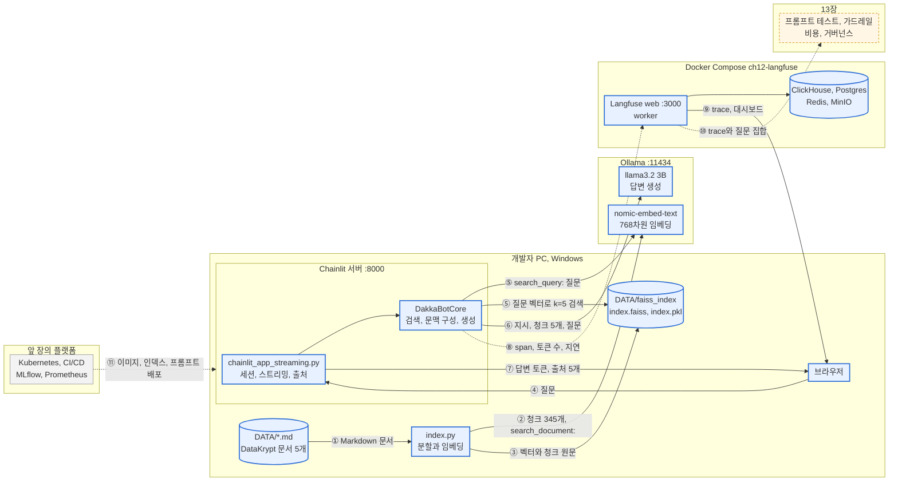
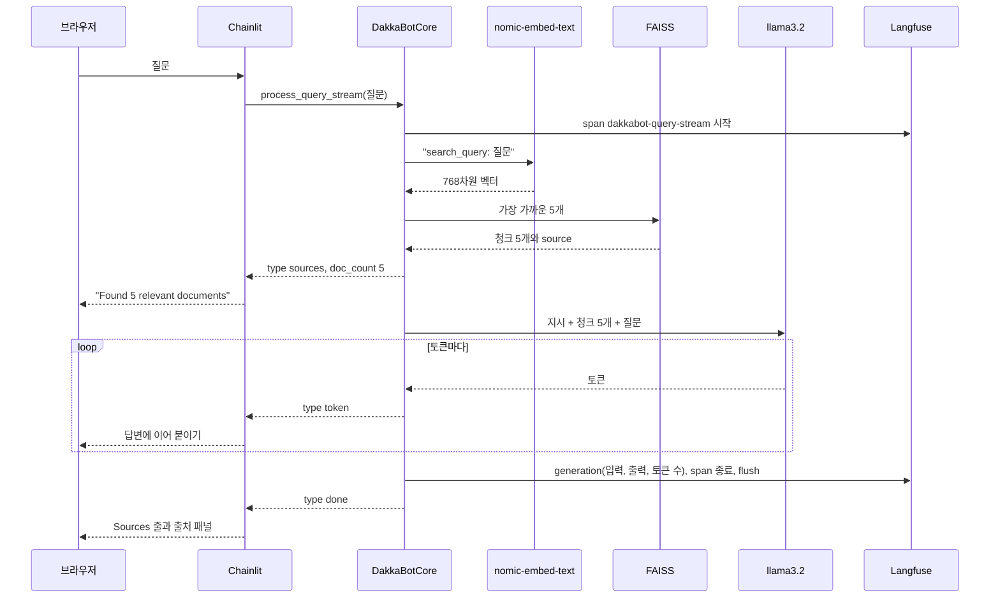
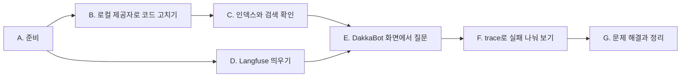

11장까지는 우리가 직접 학습한 모델 파일 하나가 예측을 결정했다. 결과가 이상하면 학습 데이터와 학습 실행을 거슬러 올라가면 됐다. 12장의 DakkaBot은 다르다. 모델은 남이 만든 LLM이다.

답변을 정하는 요소도 여럿이다. 문서를 어떻게 잘라 색인했는지, 어떤 조각을 찾았는지, 그 조각을 어떤 지시와 함께 넣었는지, 모델이 지시를 얼마나 따랐는지가 함께 작용한다. 답이 틀렸을 때 "모델이 나쁘다"로 끝내면 고칠 곳이 보이지 않는다.

이 장은 LLMOps가 앞 장의 MLOps에서 무엇을 물려받는지부터 본다. 그다음 RAG(Retrieval-Augmented Generation)를 검색, 문맥 구성, 생성으로 나누고, Chainlit 화면과 Langfuse 관측을 붙인다. [실습 순서](#book-ch12-sop)에서는 저자 코드를 직접 돌렸다. 책은 Google Gemini API를 쓰지만, 비용과 API 키 없이 누구나 따라 할 수 있게 **Ollama의 로컬 모델로 바꿨다**. LangChain, FAISS, Chainlit, 자체 호스팅 Langfuse로 된 나머지 구조는 책과 같다. 바꾼 이유와 되돌리는 법은 [제공자 교체](#provider-swap)에 적었다.

## 전체 그림 {#platform-map}

DakkaBot이 하는 일은 두 갈래다. 미리 한 번은 문서를 잘라 벡터로 바꾸고 인덱스로 저장한다. 질문마다는 관련 조각을 찾아 모델에 넣고 답을 흘려보낸다. 아래 그림은 각 부분이 어디서 돌고 무엇을 주고받는지 보여 준다. 앞 장의 플랫폼은 실제 배포 때 다시 쓰는 부분이고, 13장으로 이어지는 부분은 점선으로 그렸다.


```mermaid
%%{init: {"flowchart": {"rankSpacing": 25, "nodeSpacing": 18, "padding": 6}}}%%
flowchart LR
    accTitle: 12장 실습에서 구성 요소가 주고받는 것
    accDescr: 개발자 PC의 index.py가 DATA 폴더의 Markdown 문서를 청크로 나눠 Ollama의 nomic-embed-text로 벡터를 만들고 FAISS 인덱스 파일로 저장한다. 브라우저의 질문은 Chainlit 서버의 DakkaBotCore로 들어가 질문 벡터로 FAISS에서 청크 다섯 개를 찾고, 지시와 청크와 질문을 Ollama의 llama3.2에 넣어 토큰을 받아 출처와 함께 브라우저로 흘려보낸다. 검색과 생성 기록은 Docker Compose로 띄운 Langfuse에 span으로 남고, 개발자는 Langfuse 화면에서 trace를 본다. 앞 장의 Kubernetes와 CI/CD는 배포할 때 재사용하고, 13장은 trace와 질문 집합으로 프롬프트 테스트, 가드레일, 비용 관리를 다룬다.
    subgraph PC["개발자 PC, Windows"]
        DOCS[("DATA/*.md<br/>DataKrypt 문서 5개")]
        IDX["index.py<br/>분할과 임베딩"]
        FAISS[("DATA/faiss_index<br/>index.faiss, index.pkl")]
        subgraph APP["Chainlit 서버 :8000"]
            UI["chainlit_app_streaming.py<br/>세션, 스트리밍, 출처"]
            CORE["DakkaBotCore<br/>검색, 문맥 구성, 생성"]
        end
        BR["브라우저"]
    end
    subgraph OLL["Ollama :11434"]
        EMB["nomic-embed-text<br/>768차원 임베딩"]
        LLM["llama3.2 3B<br/>답변 생성"]
    end
    subgraph LF["Docker Compose ch12-langfuse"]
        LFW["Langfuse web :3000<br/>worker"]
        LFS[("ClickHouse, Postgres<br/>Redis, MinIO")]
    end
    subgraph PREV["앞 장의 플랫폼"]
        K8S["Kubernetes, CI/CD<br/>MLflow, Prometheus"]
    end
    subgraph NEXT["13장"]
        GOV["프롬프트 테스트, 가드레일<br/>비용, 거버넌스"]
    end
    DOCS -->|"① Markdown 문서"| IDX
    IDX -->|"② 청크 345개, search_document:"| EMB
    IDX -->|"③ 벡터와 청크 원문"| FAISS
    BR -->|"④ 질문"| UI
    UI --> CORE
    CORE -->|"⑤ search_query: 질문"| EMB
    CORE -->|"⑤ 질문 벡터로 k=5 검색"| FAISS
    CORE -->|"⑥ 지시, 청크 5개, 질문"| LLM
    UI -->|"⑦ 답변 토큰, 출처 5개"| BR
    CORE -.->|"⑧ span, 토큰 수, 지연"| LFW
    LFW --> LFS
    LFW -->|"⑨ trace, 대시보드"| BR
    LFW -.->|"⑩ trace와 질문 집합"| GOV
    K8S -.->|"⑪ 이미지, 인덱스, 프롬프트 배포"| APP
    classDef thisch fill:#e8f1ff,stroke:#2f6fd6,stroke-width:2px;
    classDef prev fill:#f3f3f3,stroke:#999;
    classDef next fill:#fff6e5,stroke:#d08a00,stroke-dasharray:4 3;
    class DOCS,IDX,FAISS,UI,CORE,BR,EMB,LLM,LFW,LFS thisch;
    class K8S prev;
    class GOV next;
```

| 번호 | 누가 | 무엇을 넘기는가 | 어디에 남는가 | 실습 단계 |
| --- | --- | --- | --- | --- |
| ① | `index.py`의 `DirectoryLoader` | `DATA/` 아래 Markdown 문서 5개(`docs_1.md`~`docs_5.md`) | 메모리의 `Document` 목록, 경로가 `source` 메타데이터로 붙는다 | [C-1](#ch12-c-1) |
| ② | `index.py`가 Ollama 임베딩 호출 | 1,000자 단위로 자른 청크 345개, 앞에 `search_document:` | 768차원 벡터 | [C-1](#ch12-c-1) |
| ③ | `FAISS.from_documents`와 `save_local` | 벡터, 청크 원문, 메타데이터 | `DATA/faiss_index/index.faiss`, `index.pkl` | [C-1](#ch12-c-1) |
| ④ | 브라우저 | 질문 문자열 | Chainlit 세션(브라우저 화면의 대화 기록) | [E-2](#ch12-e-2) |
| ⑤ | `DakkaBotCore`의 retriever | `search_query:`를 붙인 질문 벡터, 가까운 청크 5개 | Langfuse의 `VectorStoreRetriever` span | [C-2](#ch12-c-2), [F-2](#ch12-f-2) |
| ⑥ | `DakkaBotCore`가 `ChatOllama` 호출 | 시스템 지시, 번호 붙인 청크 5개, 질문을 합친 프롬프트 | Langfuse의 `ChatOllama` generation(입력, 출력, 토큰 수) | [F-3](#ch12-f-3) |
| ⑦ | Chainlit | 토큰 스트림, 끝난 뒤 "Sources" 줄과 출처 패널 | 브라우저 화면 | [E-2](#ch12-e-2), [E-3](#ch12-e-3) |
| ⑧ | Langfuse Python SDK v3(OpenTelemetry) | span 트리, 지연, 토큰 사용량 | Langfuse의 ClickHouse | [F-1](#ch12-f-1) |
| ⑨ | Langfuse web | trace 목록, span 상세, 모델별 토큰과 비용 | 화면만, 데이터는 ClickHouse | [F-1](#ch12-f-1)~[F-4](#ch12-f-4) |
| ⑩ | 13장 | 실패 사례 trace와 평가 질문 집합 | 다음 장 | 이 장에서는 실행하지 않음 |
| ⑪ | 앞 장의 배포 경로 | 앱 이미지, 인덱스 파일, 프롬프트 버전 | 클러스터 | 이 장에서는 실행하지 않음 |

질문 하나가 지나가는 순서는 아래와 같다. 눈여겨볼 점은 **출처가 답변보다 먼저 정해진다**는 것이다. 그래서 답이 틀렸을 때 trace에서 검색 결과부터 보면 된다. 모델이 잘못 읽었는지, 처음부터 엉뚱한 자료를 받았는지가 거기서 갈린다.


```mermaid
sequenceDiagram
    accTitle: DakkaBot 질문 한 번의 처리 순서
    accDescr: 브라우저의 질문이 Chainlit을 거쳐 DakkaBotCore로 들어간다. DakkaBotCore는 Langfuse span을 열고 질문을 임베딩해 FAISS에서 청크 다섯 개를 찾아 출처를 먼저 화면에 알린다. 이어 프롬프트를 llama3.2에 보내 토큰을 하나씩 받아 화면에 흘려보내고, 끝나면 generation 기록과 span을 닫아 Langfuse로 보낸 뒤 완료 신호와 출처 목록을 보낸다.
    participant U as 브라우저
    participant C as Chainlit
    participant B as DakkaBotCore
    participant E as nomic-embed-text
    participant F as FAISS
    participant L as llama3.2
    participant T as Langfuse
    U->>C: 질문
    C->>B: process_query_stream(질문)
    B->>T: span dakkabot-query-stream 시작
    B->>E: "search_query: 질문"
    E-->>B: 768차원 벡터
    B->>F: 가장 가까운 5개
    F-->>B: 청크 5개와 source
    B-->>C: type sources, doc_count 5
    C-->>U: "Found 5 relevant documents"
    B->>L: 지시 + 청크 5개 + 질문
    loop 토큰마다
        L-->>B: 토큰
        B-->>C: type token
        C-->>U: 답변에 이어 붙이기
    end
    B->>T: generation(입력, 출력, 토큰 수), span 종료, flush
    B-->>C: type done
    C-->>U: Sources 줄과 출처 패널
```

## LLMOps: 그대로 쓰는 것과 새로 관리할 것 {#llmops-vs-mlops}

책은 LLMOps를 새 분야로 소개한다. 그래도 출발점은 앞에서 만든 것을 버리지 않는다는 데 있다. DakkaBot도 결국 컨테이너로 묶여 Kubernetes에 올라가고, CI/CD로 배포되고, Prometheus로 지연과 오류를 본다. 그림의 ⑪이 그 연결이다. 바뀌는 것은 버전을 매겨야 할 대상과 품질을 판단하는 방법이다.

| 질문 | 앞 장의 MLOps | DakkaBot의 LLMOps |
| --- | --- | --- |
| 결과를 정하는 것 | 학습한 모델 가중치 | 모델 제공자와 버전, 프롬프트, 검색 코퍼스와 인덱스, 검색 파라미터 |
| 바뀌면 재배포해야 하는 것 | 모델 파일, 전처리 코드 | 위 전부. 시스템 프롬프트 한 줄도 모델 교체만큼 결과를 바꾼다 |
| 품질 판단 | 정확도, RMSE 같은 정답 비교 | 의미가 맞는가, 근거와 일치하는가, 범위 밖 질문을 거절하는가 |
| 재현성 | 같은 입력이면 같은 예측 | temperature 0이어도 같은 답이 보장되지 않는다 |
| 비용 | 서버를 켜 둔 시간 | 요청마다 입력과 출력 토큰 수 |
| 디버깅 단위 | 요청 하나, 예측 하나 | 요청 하나 안의 여러 단계(검색, 문맥 구성, 생성) |

재현성 문제는 샘플링에서 온다. LLM은 다음 토큰 후보의 확률 분포에서 하나를 고른다. temperature는 그 분포를 얼마나 평평하게 할지, top-k는 후보를 몇 개로 자를지, top-p는 누적 확률 몇까지의 후보만 남길지 정한다. 책은 사실 답변에 temperature 0을 권하면서 "완전히 결정적이지는 않다"고 덧붙인다.

직접 돌려 보니 정말 그랬다. temperature 0, 같은 프롬프트(입력 665토큰)로 "What is the capital of Australia?"를 네 번 물었다. 세 번은 문서와 무관하다며 답하지 않았고, 한 번은 같은 말 끝에 "Canberra"라고 답했다([E-3](#ch12-e-3)). 그러니 `assert answer == expected` 같은 테스트는 쓸 수 없다. 의미와 근거로 채점하는 평가가 필요하고, 13장은 거기서 시작한다.

토큰 예산은 설계를 묶는 제약이다. 입력(문맥 창)에도 출력(`max_tokens`)에도 한도가 있어서, 청크를 많이 넣을수록 답할 자리가 줄고 비용과 지연이 는다. 책의 예로는 500토큰 청크 50개를 넣으면 생성 전에 이미 25,000토큰이다. 이번 DakkaBot은 1,000자 청크 5개를 넣었고 프롬프트는 1,244토큰이었다.

로컬 모델에는 함정이 하나 더 있다. Ollama는 `num_ctx`(문맥 길이)를 넘는 프롬프트를 오류 없이 앞부분부터 잘라 버린다. 그래서 코드에서 8,192로 못 박았다.

## 왜 RAG인가 {#why-rag}

사내 문서로 답하게 하는 가장 단순한 방법은 문서 전체를 프롬프트에 넣는 것이다. 책은 이 방법이 막히는 이유를 넷 든다. 문서가 문맥 창보다 크고, 프롬프트가 길면 모델이 초점을 잃고, 한 부분을 오해하면 답 전체가 무너지고, 질문마다 같은 문서를 다시 넣는 비용이 크다.

RAG는 **찾는 일과 쓰는 일을 나눠** 질문과 관련된 조각만 넣는다. 문서가 바뀌면 모델을 다시 학습할 필요 없이 인덱스만 새로 만들면 되고, 답에 근거 문서를 붙여 사람이 확인할 수도 있다.

파인튜닝과는 목적이 다르다. RAG는 모델이 모르는 지식을 바깥에서 공급하고, 파인튜닝은 모델의 행동, 형식, 특화 능력을 바꾼다. 자주 바뀌고 출처가 중요한 사내 규정은 RAG에 맞는다. "항상 이 JSON 형식으로 답하라" 같은 요구는 프롬프트나 파인튜닝으로 풀 문제다. RAG도 잘못된 조각을 찾거나 조각을 잘못 읽으면 틀린다. 아래의 설계 선택은 모두 이 두 실패를 줄이려는 것이다.

## 검색 설계 {#retrieval-design}

LLM이 무엇을 보게 될지는 검색이 정한다. 검색이 빗나가면 뒤에 어떤 모델을 붙여도 근거 없는 답이 나온다.

### 청크 분할: 얼마나 잘라야 찾을 수 있는가 {#chunking}

문서를 통째로 임베딩하면 한 벡터에 여러 주제가 섞여 어떤 질문과도 가까워지기 어렵다. 찾더라도 너무 길어 프롬프트에 다 넣을 수 없다. 그래서 청크로 자른다. 저자 코드는 `RecursiveCharacterTextSplitter`에 `chunk_size=1000`, `chunk_overlap=200`, 구분자 `["\n## ", "\n### ", "\n\n", "\n", " ", ""]`를 준다. 제목에서 먼저 자르고, 그래도 크면 문단, 줄, 단어 순으로 내려가며 1,000자 안에 맞춘다. 겹침(overlap)은 경계에 걸린 문장이 양쪽 청크에서 뜻을 잃지 않게 해 준다.

여기서 책 본문과 코드가 어긋난다. 책은 "200토큰 겹침"이라고 쓰지만 이 splitter가 세는 것은 문자 수다. 1,000자는 영어로 대략 250토큰이다. 문서 5개를 잘랐더니 청크 345개가 나왔다.

잘린 결과를 보면 청크 경계가 의미 경계와 늘 맞지는 않는다. "How often should production API keys be rotated?"에 가장 가까운 청크는 사고 대응 절차의 "5. Post-Incident"로 시작했다. 바로 뒤에 이어지는 키 교체 주기 표가 같은 청크에 들어 있었기 때문이다. 청크의 첫 줄만 보고 관련 여부를 판단하면 틀리기 쉽다.

### 임베딩: 문서와 질문을 같은 공간에 놓는다 {#embeddings}

임베딩 모델은 뜻이 비슷한 텍스트를 가까운 벡터로 바꾼다. "API credentials를 어떻게 바꾸나"와 "key rotation 절차"는 겹치는 단어가 없어도 가까이 놓인다. 키워드 검색과 다른 점이다.

문서와 질문은 길이도 문체도 달라서, 어느 쪽인지 모델에 알려 주면 검색이 나아진다. 책의 `GeminiEmbeddings`는 문서에 `task_type="RETRIEVAL_DOCUMENT"`를, 질문에 `RETRIEVAL_QUERY`를 붙인다. `nomic-embed-text`는 같은 생각을 접두어로 구현해, 문서 앞에 `search_document: `, 질문 앞에 `search_query: `를 붙인다.

임베딩 모델과 인덱스는 한 몸이다. 색인과 검색에 다른 모델을 쓰면 두 벡터는 서로 다른 좌표계에 놓인다. 고약하게도 **차원만 같으면 오류가 나지 않는다**. `nomic-embed-text`와 책의 `text-embedding-004`는 둘 다 768차원이라, Gemini로 만든 인덱스를 nomic으로 검색해도 FAISS는 경고 없이 엉뚱한 청크를 내준다. 그래서 인덱스에는 임베딩 모델 이름을 붙여 버전을 매기고, 모델을 바꿀 때는 새 인덱스를 따로 만들어 평가한 뒤 전환한다. 실습 코드는 `FAISS_INDEX_PATH`를 제공자마다 다르게 두는 방식으로 이를 지킨다.

### 벡터 저장소: FAISS는 검색 엔진이지 데이터베이스가 아니다 {#vector-store}

FAISS는 수많은 벡터 가운데 가장 가까운 것을 빨리 찾아 주는 라이브러리다. 저자 코드는 정확 검색(Flat) 인덱스와 L2 거리를 쓴다. 값이 작을수록 가깝다. 권한, 부분 삭제, 백업, 동시 갱신 같은 데이터베이스 기능은 FAISS에 없다. 책이 운영 단계에서 Pinecone, Weaviate, Chroma 같은 벡터 DB를 언급하는 까닭이다.

저장 형식도 조심해야 한다. `save_local`은 벡터를 `index.faiss`에, 청크 원문과 메타데이터를 `index.pkl`에 쓴다. `index.pkl`은 Python pickle이라 불러올 때 `allow_dangerous_deserialization=True`가 필요하다. pickle은 불러오는 순간 코드를 실행할 수 있으니, 인덱스 파일의 출처와 무결성은 모델 파일만큼 엄격하게 관리한다. 인덱스에 원문이 그대로 들어 있다는 점도 잊기 쉽다. 원문이 민감하면 인덱스도 같은 등급의 데이터다.

### 검색 개수 k와 임계값 {#retrieval-k}

`as_retriever(search_kwargs={"k": 5})`는 무조건 가장 가까운 5개를 돌려준다. k가 작으면 필요한 근거를 놓치고, 크면 잡음과 토큰 비용이 는다. 책은 "기본 3개 대신 5개"라고 설명하는데, LangChain 벡터 저장소 retriever의 실제 기본값은 4개다.

정작 문제는 **임계값이 없다**는 데 있다. 거리를 직접 찍어 보면 차이가 뚜렷하다.

| 질문 | 상위 5개 L2 거리 |
| --- | --- |
| How do I rotate encryption keys? | 0.558 ~ 0.648 |
| How often should production API keys be rotated? | 0.389 ~ 0.732 |
| What is the capital of Australia? | 0.936 ~ 0.998 |

문서와 상관없는 질문도 청크 5개를 받아 오고, 화면은 그것을 "출처"로 보여 준다. 이 코퍼스라면 0.8 근처에 임계값을 두면 범위 밖 질문을 걸러낼 수 있어 보인다. 하지만 그 값은 이 임베딩 모델과 이 문서에서만 통하므로 평가 질문 집합으로 정해야 한다. 이번에는 저자 코드대로 임계값 없이 두었고, 그 결과는 [E-3](#ch12-e-3)에서 본다.

## 문맥 구성과 근거 표시 {#augmentation-grounding}

문맥 구성(augmentation)은 찾은 청크를 질문과 함께 프롬프트 하나로 엮는 단계다. 저자 코드의 최소 버전(리스팅 12.10, 12.12)은 청크를 빈 줄로 이어 붙여 "Context, Question, Answer" 틀에 넣는다. `DakkaBotCore`(리스팅 12.14)는 여기에 몇 가지를 더한다. 청크마다 `**Document 1:**`처럼 번호를 달고, "DataKrypt 전문 개발자 도우미"라는 역할을 주고, "문서에 근거해 답하라, 모르면 모른다고 하라, DataKrypt 정보에 집중하라" 같은 지시를 넣는다.

이 단계에서 먼저 볼 것은 실제로 무엇이 들어갔는가다. 검색 결과는 길이 제한에 잘리거나, 형식이 깨지거나, 다른 문서와 섞인 채 들어갈 수 있다. 저자 코드의 프롬프트는 클래스 안에서 들여쓴 f-string이라 지시 줄마다 공백 12칸이 따라 들어간다. Markdown에서 4칸 이상 들여쓴 줄은 코드 블록이 되므로 Langfuse 화면에서도 지시문이 코드 블록으로 보인다([F-3](#ch12-f-3)). 토큰 낭비이고, 모델에 따라 지시를 덜 따르게 만들 수도 있다.

출처가 사용자에게 보이는지도 중요하다. 책은 출처 표시를 신뢰의 핵심으로 꼽고, `process_query_stream`도 출처를 가장 먼저 내보낸다. 그런데 저자의 Chainlit 앱은 출처를 받아 두기만 하고 화면에 그리지 않았다. 실습에서는 답변 끝에 "Sources" 줄과 청크 원문 패널을 붙였다([B-3](#ch12-b-3)).

출처를 근거로 착각해서도 안 된다. 출처는 "이 청크들을 모델에 줬다"는 기록일 뿐이다. 답의 각 문장이 그 청크에 있는지는 사람이 보거나 13장의 평가 도구가 따진다.

검색된 문서에 "이전 지시를 무시하라" 같은 문장이 있으면 모델은 그것을 지시로 읽을 수 있다. 간접 프롬프트 주입이다. 문맥 구성 단계에서는 문서와 지시를 구분해 표시하고, 검색 단계에서는 사용자가 볼 권한이 있는 문서만 남긴다. 생성 뒤의 답변 검사가 권한 필터를 대신하지는 못한다.

## 생성 {#generation}

생성 단계에서는 모델과 샘플링 설정, 출력 규칙을 정한다. 책은 `gemini-2.5-flash`를 `temperature=0`으로 쓴다. 이번 실습은 그 자리에 Ollama의 `llama3.2`(3B 파라미터, 4비트 양자화, 2.0GB)를 같은 temperature로 넣었다.

모델 크기가 답을 얼마나 바꾸는지는 검색 결과를 고정하고 모델만 바꿔 보면 드러난다. "How often should production API keys be rotated?"에 대해 두 로컬 모델은 똑같은 청크 5개를 받았다.

| 모델 | 걸린 시간(CPU) | 답 |
| --- | --- | --- |
| `llama3.2` 3B | 49.4초 | "every 90 days"라고 맞게 답하고 근거 표를 인용했다. 다만 뒤에 API 키 교체 명령과 암호화 키 교체 API를 섞은 예시를 덧붙였다 |
| `gemma3:270m` | 5.8초 | 질문과 무관한 사용자 활동 조회 API의 JSON 예시를 그대로 복사했다 |

검색은 둘 다 맞았다. 270M 모델은 문맥에서 답을 골라내는 능력 자체가 모자랐다. 3B 모델은 답을 찾았지만 문맥 안의 인접 절차를 섞었다.

1~2B 모델(`llama3.2:1b`, `qwen2.5:1.5b` 등)은 디스크 여유가 없어 돌려 보지 못했다. 크기로 보면 둘 사이일 것이다. 사실 하나를 찾는 질문은 대체로 맞히겠지만, 여러 절차를 구분하거나 "모르면 모른다고 하라"를 끝까지 지키는 능력은 3B보다 떨어지리라 본다. 바꿔 쓰려면 같은 질문으로 직접 비교해야 한다. Gemini 같은 대형 상용 모델은 이 차이가 훨씬 작고 답도 몇 초면 나온다.

그래도 작은 로컬 모델은 **검색은 맞고 생성이 틀린 사례**를 쉽게 만들어 준다. 실패를 나눠 보는 연습에는 오히려 낫다.

## 제공자 교체: Gemini 대신 Ollama {#provider-swap}

책은 Google AI Studio에서 API 키를 받아 Gemini로 임베딩과 생성을 한다. 이 실습이 Ollama로 바꾼 이유는 둘이다. 누구나 비용과 계정 없이 같은 결과를 재현할 수 있어야 하고, 책의 모델이 이제 그대로 동작하지 않는다. Google의 [Gemini API 단종 목록](https://ai.google.dev/gemini-api/docs/deprecations)을 보면 `text-embedding-004`는 2026년 1월 14일에 종료됐고(권장 대체는 `gemini-embedding-2`), `gemini-2.5-flash`는 2026년 12월 1일부터 요청이 다른 모델로 넘어간다. 책 코드에 키만 넣어 돌리면 인덱싱에서 바로 실패한다.

| 역할 | 책 | 이 실습 | 바꾼 위치 |
| --- | --- | --- | --- |
| 임베딩 | `text-embedding-004`, `task_type` 지정 | Ollama `nomic-embed-text`(274MB), `search_document:`, `search_query:` 접두어 | `index.py`의 `OllamaNomicEmbeddings`, `get_embeddings()` |
| 생성 | `gemini-2.5-flash`, `temperature=0` | Ollama `llama3.2`, `temperature=0`, `num_ctx=8192` | `dakka_bot_core.py`의 `get_llm()` |
| 관측 | Langfuse 자체 호스팅 | 같다. 현재 저장소 기준 v4.76.0 | 키를 코드 대신 `.env`에서 |
| 그 밖 | LangChain, FAISS, Chainlit | 같다(저자 `requirements.txt` 버전 고정) | 없음 |

LangChain은 임베딩과 LLM을 같은 인터페이스(`Embeddings`, chat model)로 감싸므로 교체는 두 함수 안에서 끝났다. 책이 LangChain의 장점으로 꼽은 "구성 요소 교체"는 실제로 이 정도로 간단했다. Gemini로 되돌리려면 `.env`의 아래 줄만 바꾸고 인덱스를 새로 만든다. API 키가 필요한 경로라 이번에는 실행하지 않았다.

```text
LLM_PROVIDER=gemini
EMBEDDING_PROVIDER=gemini
GEMINI_API_KEY=<AI Studio에서 받은 키>
GEMINI_EMBED_MODEL=gemini-embedding-2
GEMINI_MODEL=gemini-2.5-flash
FAISS_INDEX_PATH=./DATA/faiss_index_gemini
```

`GEMINI_EMBED_MODEL`을 빼면 책과 같은 `text-embedding-004`를 쓰게 되고, 이미 종료된 모델이라 실패한다. `gemini-embedding-2`가 책의 `task_type` 설정을 그대로 받는지는 키가 없어 확인하지 못했다. `GEMINI_MODEL`은 그때그때 Gemini 모델 목록에서 고른다. 인덱스 경로를 따로 두는 것은 [임베딩](#embeddings)에서 말한 대로 다른 모델의 벡터가 섞이지 않게 하려는 것이다.

## UI와 세션 상태 {#ui-session-state}

책은 RAG 로직을 `DakkaBotCore` 클래스로 빼고 UI를 그 위에 얹는다. Chainlit, API 서버, 테스트가 같은 클래스를 쓰게 하려는 설계다. 테스트용 동기 래퍼 `dakka_bot_query`는 13장의 promptfoo와 DeepEval도 부른다.

Chainlit은 스트리밍, 메시지 기록, 첨부 패널을 Python 몇 줄로 제공한다. `@cl.on_chat_start`는 새 대화마다, `@cl.on_message`는 질문마다 호출된다. `process_query_stream`은 비동기 제너레이터로 `sources`, `token`(여러 번), `done` 순서의 이벤트를 내보내고, 앱은 그에 맞춰 화면을 "Searching...", "Found 5 relevant documents", 답변 스트리밍 순으로 바꾼다. 출처를 먼저 보내는 것은 기다리는 동안 무엇을 근거로 답할지 보여 주려는 것이다.

세션 상태 쪽은 코드를 읽다 걸리는 데가 많았다. 우선 봇 인스턴스 하나를 모든 사용자가 공유한다. 모듈 전역의 `dakka_bot = DakkaBotCore()`를 쓰고, 새 대화마다 `initialize()`가 FAISS 인덱스와 모델 연결을 다시 만든다. 둘 다 상태가 없어 답이 섞이지는 않지만, 여러 사용자가 동시에 대화를 시작하면 같은 객체를 동시에 다시 초기화하게 된다.

대화 기억도 없다. `process_query_stream`은 지금 질문 하나만 받으므로 "그다음 단계는?" 같은 후속 질문은 문맥을 잃는다. 기억을 넣으려면 `cl.user_session`에 기록을 두고 검색 질의와 프롬프트에 함께 넣어야 하고, 그만큼 토큰 예산이 준다. 코드를 읽고 내린 판단이고, 후속 질문을 따로 시험하지는 않았다.

사용자 식별도 빠져 있다. trace metadata가 `"user_session": "demo"`로 고정이라, 비용과 품질을 사용자별, 팀별로 보려면 Chainlit 세션 ID나 로그인 사용자를 trace에 넣어야 한다.

## 관측: trace, span, 토큰, 지연, 비용 {#observability}

CPU 사용률이나 지연 같은 기존 지표는 서비스가 고장 났는지는 알려 주지만 **답이 왜 나쁜지**는 알려 주지 못한다. LLM 앱에서 궁금한 것은 어떤 청크를 찾았고, 모델에 실제로 무엇을 넣었고, 모델이 무엇을 냈고, 단계마다 얼마나 걸렸고 토큰을 몇 개 썼는지다. Langfuse는 이것을 trace 단위로 남긴다.

| 용어 | 뜻 | DakkaBot에서 |
| --- | --- | --- |
| trace | 요청 하나의 전체 기록 | 질문 하나 |
| span | trace 안의 한 단계, 시작과 끝 시간과 입출력 | `dakkabot-query-stream`(전체), `VectorStoreRetriever`(검색) |
| generation | 모델 호출을 기록하는 특별한 span. 모델 이름, 파라미터, 토큰 수, 비용 | `ChatOllama` |
| 첫 토큰 시간 | 요청 시작부터 첫 토큰까지. 스트리밍 UI에서 사용자가 체감하는 대기 | generation의 completion start time |

저자 코드는 LangChain 콜백(`CallbackHandler`)을 LLM 호출에만 넘겨서, trace에는 generation 하나만 남고 검색 결과는 보이지 않는다. 책은 콜백만 붙이면 검색도 기록된다고 설명하지만, 콜백은 자기를 넘겨받은 호출만 기록한다. 실습에서는 질문 하나를 Langfuse span으로 감싸고 retriever에도 같은 콜백을 넘겼다. 그러자 `dakkabot-query-stream` 아래에 `VectorStoreRetriever`와 `ChatOllama`가 달린 trace가 남았다([F-1](#ch12-f-1)).

비용은 Langfuse가 모델 이름으로 단가표를 찾아 토큰 수에 곱한 값이다. 책의 화면은 Gemini 호출이라 질문당 비용이 찍히지만, `llama3.2`는 단가표에 없어 $0이다([F-4](#ch12-f-4)). 로컬 모델의 비용은 토큰이 아니라 하드웨어와 시간이다. GPU 없는 노트북 CPU에서 1,244토큰을 넣고 610토큰을 받는 답변 하나에 57초가 걸렸다. 상용 API라면 몇 초, 몇 원이면 끝난다. 어느 쪽이 싼지는 요청량과 지연 요구가 정한다.

trace에는 질문, 검색된 문서, 답변이 모두 담긴다. 원문과 질문이 민감하다면 trace 저장소에도 같은 등급의 접근 권한, 보존 기간, 마스킹이 필요하다. 책이 Langfuse를 자체 호스팅하는 이유 중 하나다.

## 실패를 나눠 보는 기준 {#failure-taxonomy}

"답이 틀렸다"는 증상은 하나여도 원인은 단계마다 다르고, 고칠 곳도 다르다. trace에서 어디를 보면 되는지와 함께 정리하면 다음과 같다.

| 실패 | 판별 질문 | trace에서 볼 곳 | 고치는 곳 | 이번 실습에서 본 사례 |
| --- | --- | --- | --- | --- |
| 검색 누락 | 필요한 근거가 상위 k개에 있는가? | `VectorStoreRetriever` 출력 | 분할, 임베딩 모델, k, 질의 재작성 | 직접 만나지 않음. 확인한 질문은 모두 근거가 상위 5개 안에 있었다 |
| 문맥 구성 오류 | 그 근거가 프롬프트에 실제로 들어갔는가, 다른 절차와 섞였는가? | `ChatOllama` 입력 | 청크 형식, 길이 제한, 중복 제거 | 암호화 키 교체 질문에 API 키 교체 절차 청크가 함께 들어감 |
| 생성 오류 | 근거가 있는데 모델이 잘못 읽었는가? | generation 입력과 출력 비교 | 모델, 프롬프트 지시, 출력 형식 | `gemma3:270m`이 무관한 JSON을 복사함 |
| 환각 | 근거에 없는 내용을 지어냈는가? | 출력 문장을 검색 결과와 대조 | 프롬프트, 근거 확인 평가, 더 큰 모델 | `apiVersion: v1`인 Deployment YAML을 만들어 냄(문서에 없음, 잘못된 API 버전) |
| 범위 밖 응답 | 답이 문서에 없을 때 거절하는가? | 검색 거리, 출력 | 거리 임계값, 거절 지시, 가드레일 | 같은 질문에 한 번은 "Canberra"라고 답하고 한 번은 거절함 |

"How do I rotate encryption keys?"의 답이 좋은 예다. 1단계(키 교체 API 호출)는 문서의 `key-management-service` API를 정확히 인용했다. 문제는 3단계다. 함께 검색된 **API 키** 교체 절차의 "Update applications with new key"를 암호화 키 절차처럼 가져왔고, 문서에 없는 Deployment YAML까지 지어냈다. 출처 5개는 모두 그럴듯해서 화면만 보면 근거 있는 답이다. trace에서 검색 출력과 생성 입력을 나란히 놓고서야 어디서 섞였는지 보였다. 이런 사례를 정답 근거와 함께 모아 두면 13장 평가의 재료가 된다.

검색 품질과 답변 품질은 따로 잰다. 검색은 질문마다 정답 근거 청크를 정해 두고 그것이 상위 k개에 드는지(Recall@k)를 본다. 답변은 정답성, 근거 충실성, 관련성, 거절 여부를 본다. 점수 하나로 뭉뚱그리면 검색, 모델, 프롬프트 중 무엇을 바꿔서 나아졌는지 가릴 수 없다.

## 책 코드와 실제 저장소의 차이 {#book-code-gaps}

12장 코드는 저자 저장소 [practical-mlops/dakkabot](https://github.com/practical-mlops/dakkabot)에 있다. 이 글은 `main`의 최신 커밋 `8d16c23`(2025-07-17)을 기준으로 했다. 12장 내용은 그 앞의 `5467828`(최소 RAG)부터 `77fb0b0`(스트리밍)까지이고, 마지막 두 커밋은 13장의 promptfoo와 DeepEval을 더한다. 돌려 보면서 책과 어긋난 곳은 다음과 같다.

| 위치 | 책 | 저장소와 실제 동작 | 이 실습의 처리 |
| --- | --- | --- | --- |
| 리스팅 12.2 | `from langchain.callbacks import LangfuseCallbackHandler` | 그런 경로는 없다. 저장소는 `from langfuse.langchain import CallbackHandler`(Langfuse SDK v3) | 저장소 방식 |
| 리스팅 12.19 | Langfuse 키를 환경 변수에서 읽음 | `dakka_bot_core.py`와 `minimal_rag_with_tracing.py`에 키가 문자열로 박혀 있음 | 환경 변수(`.env`)로 |
| 12.4.2 | 콜백만 붙이면 검색도 기록 | 콜백을 LLM 호출에만 넘겨 trace에 생성 단계만 남음 | span으로 감싸고 retriever에도 콜백 |
| 12.3 | UI가 출처를 표시 | `sources`를 받아 두고 표시하지 않음 | "Sources" 줄과 출처 패널 추가 |
| 리스팅 12.13 | "기본 3개 대신 5개" | LangChain retriever 기본값은 4개 | 설명만 |
| 12.2.4 | "200토큰 겹침" | `RecursiveCharacterTextSplitter`는 문자 수 기준 | 설명만 |
| `requirements.txt` | 해당 없음 | `index.py`가 쓰는 `tqdm`이 목록에 없음. 13장 패키지 없이 설치하면 `ModuleNotFoundError` | `tqdm` 추가 설치 |
| `guardrail_helpers.py` | 리스팅 12.17이 import | Guardrails Hub 검증기(계정 토큰 필요)가 있어야 import되고, import할 때 `OTEL_SDK_DISABLED=true`를 설정해 **같은 프로세스의 Langfuse 기록을 조용히 끈다** | 13장 전까지 import하지 않음 |
| `process_query_stream` | 해당 없음 | UI가 `done`을 받고 반복을 멈추므로, span을 제너레이터 끝까지 열어 두면 OpenTelemetry 문맥 해제 오류가 난다 | `done` 전에 span을 닫음 |
| 12.2.3 | `text-embedding-004`, `gemini-2.5-flash` | 각각 종료, 단종 예정 | 로컬 모델로 교체, 모델 이름을 환경 변수로 |
| 12.4.1 | `git clone` 뒤 `docker compose up` | 지금 저장소는 Langfuse v4이고 AI gateway 서비스가 추가됐다. 9000, 6379 포트가 이미 쓰이고 있으면 그대로는 뜨지 않음 | 포트를 덮어쓰는 override 파일 |

가장 찾기 어려웠던 것은 `OTEL_SDK_DISABLED` 문제다. 오류 메시지가 전혀 없었다. 같은 코드를 별도 스크립트로 돌리면 trace가 남는데, Chainlit 앱에서만 남지 않았다. 원인은 Langfuse SDK v3가 OpenTelemetry 위로 옮겨 간 데 있었다. 다른 라이브러리가 OpenTelemetry를 끄자 Langfuse까지 같이 꺼진 것이다. 13장에서 가드레일을 켤 때도 import 뒤에 이 설정을 되돌려야 한다.

## 이 장이 남기는 한계 {#remaining-limits}

DakkaBot은 검색, 문맥 구성, 생성을 나누고 그 과정을 trace로 남기는 데까지 왔다. 돌려 보면 남은 일도 또렷하다.

가장 큰 빈자리는 평가다. 이번 판단은 모두 사람이 화면과 trace를 읽고 내렸다. 정답 근거가 달린 질문 집합과 자동 채점 없이는 프롬프트나 k를 바꿨을 때 나아졌는지 알 수 없다. 범위 밖 질문도 막지 못한다. 임계값이 없어 무관한 질문에도 출처 5개가 붙고, 거절 여부는 실행마다 달랐다.

프롬프트는 코드 안의 문자열이라, 고치려면 코드를 배포해야 하고 어떤 프롬프트 버전이 어떤 trace를 만들었는지도 이어지지 않는다. 권한과 갱신도 없다. 모든 사용자가 모든 문서를 검색하고, 문서가 바뀌면 인덱스 전체를 다시 만든다. 대화 기억과 사용자 식별도 빠져 있다. 비용은 보이지 않는다. 로컬 모델은 단가표가 없어 $0이고, 상용 모델로 바꾸면 질문 유형별 토큰 비용을 따로 봐야 한다.

13장은 이 가운데 프롬프트 관리와 테스트, 가드레일, 비용과 거버넌스를 다룬다. 그림의 ⑩이 그 연결이다.

## 실습 순서 {#book-ch12-sop}

로컬 모델을 준비하고, 저자 코드를 로컬 제공자로 고치고, 인덱스를 만든다. 그다음 Langfuse를 띄우고 Chainlit 화면에서 질문한 뒤, trace에서 검색과 생성을 나눠 본다. 아래 출력과 화면은 2026년 11월 8일 이 순서대로 실행해 얻었다. 실행 환경은 Windows 11 노트북(13세대 Core i7, RAM 64GB, GPU 없음), Docker Desktop, Ollama 0.40.12다. 쿠버네티스 클러스터는 쓰지 않는다.


```mermaid
flowchart LR
    accTitle: 12장 실습 순서
    accDescr: Ollama와 모델, 저자 코드와 가상환경을 준비하고, 저자 코드를 로컬 제공자로 고친다. 인덱스를 만들어 검색을 확인하고, Langfuse를 띄운 뒤 Chainlit 화면에서 질문한다. 이어 Langfuse trace로 검색과 생성을 나눠 보고 정리한다.
    A["A. 준비"] --> B["B. 로컬 제공자로 코드 고치기"]
    B --> C["C. 인덱스와 검색 확인"]
    A --> D["D. Langfuse 띄우기"]
    C --> E["E. DakkaBot 화면에서 질문"]
    D --> E
    E --> F["F. trace로 실패 나눠 보기"]
    F --> G["G. 문제 해결과 정리"]
```

| 구간 | 끝났을 때 남는 것 |
| --- | --- |
| A. 준비 | Ollama의 `llama3.2`, `nomic-embed-text`, 저자 코드 `ch12\dakkabot`, 가상환경 `ch12\venv` |
| B. 로컬 제공자로 코드 고치기 | 제공자를 고르는 `get_embeddings()`, `get_llm()`, trace span, 출처 표시, `.env` |
| C. 인덱스와 검색 확인 | `DATA\faiss_index`(청크 345개), 질문별 검색 거리 |
| D. Langfuse 띄우기 | `ch12-langfuse` 컨테이너 6개, 프로젝트 `dakkabot`과 API 키 |
| E. DakkaBot 화면에서 질문 | 근거 있는 답과 범위 밖 질문의 화면, 출처 패널 |
| F. trace로 실패 나눠 보기 | 검색 span, generation, 토큰과 비용 화면, 모델 크기 비교 |
| G. 문제 해결과 정리 | 멈춘 서버, 13장에서 다시 켜는 방법 |

명령은 PowerShell에서 실행한다. 작업 폴더 아래 `ch12\`를 만들고, 그 안에 저자 코드(`ch12\dakkabot`), 가상환경(`ch12\venv`), Langfuse 설정(`ch12\langfuse`)을 둔다. 폴더를 따로 적지 않은 명령은 작업 폴더에서 실행한다.

## A. 준비 {#ch12-a}

지금 위치는 전체 그림의 ②, ⑤, ⑥이다. 이 단계들이 쓸 모델과 코드를 준비한다.

### A-1. 디스크와 도구 확인 {#ch12-a-1}

1. 남은 디스크를 확인한다. 새로 필요한 공간은 `llama3.2` 2.0GB, `nomic-embed-text` 274MB, Langfuse 이미지 약 3.4GB(langfuse 1.03GB, worker 803MB, ClickHouse 1.19GB, MinIO 236MB, Redis 170MB, Postgres 17-alpine은 이미 있던 것을 썼다), 가상환경 약 250MB다. Docker 이미지는 Docker Desktop의 가상 디스크 파일 안에 쌓이는데, 이미지를 지워도 이 파일은 저절로 줄지 않는다.
   ```powershell
   "{0:N1} GB" -f ((Get-PSDrive C).Free/1GB)
   ```
2. Ollama를 설치하고 버전을 확인한다. 설치가 끝나면 백그라운드 서비스가 `http://127.0.0.1:11434`에서 요청을 기다린다.
   ```powershell
   winget install Ollama.Ollama
   ollama --version
   ```
   ```text
   ollama version is 0.40.12
   ```
3. Docker Desktop이 켜져 있는지 보고, Langfuse가 쓸 포트 3000, 9090과 Chainlit이 쓸 8000이 비어 있는지 확인한다. 아무것도 출력되지 않으면 비어 있다.
   ```powershell
   docker version --format '{{.Server.Version}}'
   Get-NetTCPConnection -State Listen -LocalPort 3000,8000,9090 -ErrorAction SilentlyContinue
   ```

### A-2. 모델 내려받기 {#ch12-a-2}

1. 생성 모델과 임베딩 모델을 받는다. 이번에는 `llama3.2`가 이미 있어서 `nomic-embed-text`만 새로 받았다. 디스크가 부족하면 `llama3.2:1b`(1.3GB)를 받고 B-4의 `OLLAMA_MODEL`을 바꾼다. 1B 모델로는 이 글을 검증하지 않았다.
   ```powershell
   ollama pull llama3.2
   ollama pull nomic-embed-text
   ollama list
   ```
   ```text
   NAME                       ID              SIZE      MODIFIED
   nomic-embed-text:latest    0a109f422b47    274 MB    14 seconds ago
   llama3.2:latest            a80c4f17acd5    2.0 GB    9 months ago
   gemma3:270m                e7d36fb2c3b3    291 MB    10 months ago
   ```
   관련 있는 줄만 남겼다. `gemma3:270m`은 원래 있던 모델이고 [F-5](#ch12-f-5)의 비교에만 쓴다. 따라 할 때는 `ollama pull gemma3:270m`(291MB)으로 받는다.

### A-3. 저자 코드와 가상환경 {#ch12-a-3}

1. 저자 저장소를 받고 이 글에서 확인한 커밋으로 고정한다.
   ```powershell
   git clone https://github.com/practical-mlops/dakkabot.git ch12\dakkabot
   git -C ch12\dakkabot checkout 8d16c23
   ```
   `DATA\docs_1.md`~`docs_5.md`는 DataKrypt라는 가상 회사의 사내 문서로, API 문서, 운영 절차, 보안 규정이 섞여 있다.
2. 가상환경을 만들고 패키지를 설치한다. 버전은 저자 `requirements.txt`를 따르고 `langchain-ollama`와 `tqdm`만 더했다. `guardrails-ai`, `deepeval`, `flashrank`는 13장 몫이라 지금은 설치하지 않는다. Gemini 패키지는 되돌릴 때를 대비해 남겨 둔다.
   ```powershell
   uv venv ch12\venv --python 3.12
   uv pip install --python ch12\venv langchain==0.3.26 langchain-community==0.3.27 langchain-google-genai==2.1.7 google-genai==1.25.0 faiss-cpu==1.11.0 dotenv==0.9.9 langfuse==3.1.3 chainlit==2.6.2 langchain-ollama==0.3.6 tqdm
   ```

완료 기준: `ollama list`에 두 모델이 보이고, `ch12\venv\Scripts\python.exe -c "import langchain_ollama, faiss, chainlit, langfuse; print('ok')"`가 `ok`를 출력한다.

## B. 로컬 제공자로 코드 고치기 {#ch12-b}

지금 위치는 전체 그림의 ②, ⑤, ⑥, ⑧이다. 임베딩과 생성 제공자를 바꾸고, 관측과 출처 표시의 빈틈을 메운다. 고칠 파일은 `ch12\dakkabot` 안의 세 개다.

### B-1. 임베딩: index.py {#ch12-b-1}

1. 파일 위쪽의 `from google import genai`, `from google.genai import types`를 지우고 `import os`를 더한다. Google 패키지는 Gemini를 쓸 때만 불러오도록 `GeminiEmbeddings.__init__` 안으로 옮기고, 모델 이름은 환경 변수에서 받는다.
   ```python
   class GeminiEmbeddings(Embeddings):
       def __init__(self):
           from google import genai
           from google.genai import types
           self.types = types
           # text-embedding-004 was shut down on 2026-01-14; set GEMINI_EMBED_MODEL=gemini-embedding-2
           self.model = os.getenv("GEMINI_EMBED_MODEL", "text-embedding-004")
           self.client = genai.Client()
       # embed_documents, embed_query: model=self.model, config=self.types.EmbedContentConfig(...)
   ```
2. 같은 자리에 로컬 임베딩 클래스와 선택 함수를 더한다. 책의 `task_type` 구분을 `nomic-embed-text`의 접두어로 옮긴 것이다.
   ```python
   class OllamaNomicEmbeddings(Embeddings):
       def __init__(self):
           from langchain_ollama import OllamaEmbeddings
           self.model = os.getenv("OLLAMA_EMBED_MODEL", "nomic-embed-text")
           self.client = OllamaEmbeddings(model=self.model)

       def embed_documents(self, texts: List[str]) -> List[List[float]]:
           embeddings = []
           for text in tqdm(texts, desc="Embedding documents"):
               embeddings.append(self.client.embed_query(f"search_document: {text}"))
           return embeddings

       def embed_query(self, text: str) -> List[float]:
           return self.client.embed_query(f"search_query: {text}")


   def get_embeddings() -> Embeddings:
       if os.getenv("EMBEDDING_PROVIDER", "ollama").lower() == "gemini":
           return GeminiEmbeddings()
       return OllamaNomicEmbeddings()


   INDEX_PATH = os.getenv("FAISS_INDEX_PATH", "./DATA/faiss_index")
   ```
3. `create_faiss_index`와 `load_index`의 `GeminiEmbeddings()`를 `get_embeddings()`로, `save_index`와 `load_index`의 기본 경로 `"./DATA/faiss_index"`를 `INDEX_PATH`로 바꾼다.

### B-2. 생성과 trace: dakka_bot_core.py {#ch12-b-2}

1. `ChatGoogleGenerativeAI` import와 `from index import GeminiEmbeddings`를 지우고, 제공자를 고르는 함수를 둔다.
   ```python
   from index import get_embeddings, INDEX_PATH


   def get_llm():
       if os.getenv("LLM_PROVIDER", "ollama").lower() == "gemini":
           from langchain_google_genai import ChatGoogleGenerativeAI
           return ChatGoogleGenerativeAI(
               model=os.getenv("GEMINI_MODEL", "gemini-2.5-flash"),
               temperature=0.0,
               google_api_key=os.environ["GEMINI_API_KEY"],
               convert_system_message_to_human=True
           )
       from langchain_ollama import ChatOllama
       return ChatOllama(
           model=os.getenv("OLLAMA_MODEL", "llama3.2"),
           temperature=0.0,
           # Ollama silently truncates prompts longer than num_ctx
           num_ctx=int(os.getenv("OLLAMA_NUM_CTX", "8192")),
       )
   ```
2. `initialize()`에서 임베딩, 인덱스 경로, 모델, Langfuse 키를 바꾼다. 키는 리스팅 12.19처럼 환경 변수에서 읽는다.
   ```python
   embeddings = get_embeddings()
   self.vector_store = FAISS.load_local(INDEX_PATH, embeddings=embeddings,
                                        allow_dangerous_deserialization=True)
   ...
   self.llm = get_llm()
   self.langfuse = Langfuse(
       public_key=os.environ["LANGFUSE_PUBLIC_KEY"],
       secret_key=os.environ["LANGFUSE_SECRET_KEY"],
       host=os.environ.get("LANGFUSE_HOST", "http://localhost:3000")
   )
   self.langfuse_handler = CallbackHandler()
   ```
3. `process_query_stream`의 본문을 span 하나로 감싸고, retriever에도 콜백을 넘긴다. `done`은 span을 닫은 **뒤에** 보내야 한다. Chainlit은 `done`을 받는 즉시 반복을 멈추므로, span이 그 뒤까지 열려 있으면 닫히지 못하고 OpenTelemetry가 `Failed to detach context` 오류를 낸다. 처음에 실제로 이 오류를 만났다. `process_query`에도 같은 방식으로 span(`dakkabot-query`)을 둔다.
   ```python
   try:
     with self.langfuse.start_as_current_span(name="dakkabot-query-stream", input={"query": query}) as span:
       docs = self.retriever.invoke(query, config={"callbacks": [self.langfuse_handler]})
       ...                                   # sources를 yield, context와 prompt 구성(저자 코드 그대로)
       answer = []
       async for chunk in self.llm.astream(prompt, config={"callbacks": [self.langfuse_handler]}):
           if chunk.content:
               answer.append(chunk.content)
               yield {"type": "token", ...}
       span.update(output="".join(answer))
       span.update_trace(input={"query": query}, output="".join(answer),
                         metadata={"doc_count": len(docs), "context_length": len(context)})
     self.langfuse.flush()
     yield {"type": "done", "content": None, "sources": sources, "doc_count": len(docs)}
   except Exception as e:
       ...
   ```
   들여쓰기가 두 칸인 것은 저자 코드의 나머지 줄을 건드리지 않고 `with`만 끼워 넣었기 때문이다. 새로 쓴다면 본문 전체를 한 단계 들여쓴다.

### B-3. 화면: chainlit_app_streaming.py {#ch12-b-3}

1. `from guardrail_helpers import validate_user_inputs`를 아래로 바꿔, 13장 전까지는 입력을 그대로 통과시킨다. 이 import가 `OTEL_SDK_DISABLED=true`를 설정해 Langfuse 기록을 꺼 버리기 때문이다.
   ```python
   import os

   if os.getenv("ENABLE_GUARDRAILS", "false").lower() == "true":
       from guardrail_helpers import validate_user_inputs
   else:
       def validate_user_inputs(text: str):
           return text, True
   ```
2. `chunk["type"] == "done"` 분기에서 `response_msg.send()` 앞에 출처를 붙인다. 답변 본문에 `cl.Text`의 `name`이 나오면 Chainlit이 그 이름을 원문을 여는 링크로 바꿔 준다.
   ```python
   if sources_info:
       names = []
       for src in sources_info["sources"]:
           name = f"[{src['index']}] {src['source']}"
           names.append(name)
           response_msg.elements.append(
               cl.Text(name=name, content=src["full_content"], display="side"))
       await response_msg.stream_token("\n\n**Sources:** " + ", ".join(names))
   ```

### B-4. 설정 파일 .env {#ch12-b-4}

1. `ch12\dakkabot\.env`를 만든다. 저자 저장소의 `.gitignore`가 이 파일을 제외해 준다. Langfuse 키는 D-1에서 Langfuse가 처음 뜰 때 만들어지게 할 로컬 전용 값이다.
   ```text
   LLM_PROVIDER=ollama
   OLLAMA_MODEL=llama3.2
   OLLAMA_NUM_CTX=8192
   EMBEDDING_PROVIDER=ollama
   OLLAMA_EMBED_MODEL=nomic-embed-text
   FAISS_INDEX_PATH=./DATA/faiss_index
   LANGFUSE_PUBLIC_KEY=pk-lf-ch12-local
   LANGFUSE_SECRET_KEY=sk-lf-ch12-local
   LANGFUSE_HOST=http://localhost:3000
   ```

완료 기준: `ch12\dakkabot`에서 `..\venv\Scripts\python.exe -c "import sys; sys.path.insert(0,'.'); import index, dakka_bot_core; print('import ok')"`가 `import ok`를 출력한다.

## C. 인덱스와 검색 확인 {#ch12-c}

지금 위치는 전체 그림의 ①~③과 ⑤다. 생성 모델 없이 검색부터 확인한다. 검색이 맞아야 뒤 단계의 결과를 해석할 수 있다.

### C-1. 인덱스 만들기 {#ch12-c-1}

1. 저자 코드 폴더에서 `index.py`를 실행한다. 문서를 읽어 자르고, 청크마다 임베딩을 받아 FAISS 인덱스로 저장한 뒤, 시험 질문 하나로 검색까지 해 본다.
   ```powershell
   cd ch12\dakkabot
   ..\venv\Scripts\python.exe index.py
   ```
   ```text
   INFO:__main__:Loaded 5 documents
   INFO:__main__:Created 345 chunks
   INFO:__main__:Creating FAISS index with OllamaNomicEmbeddings...
   Embedding documents: 100%|##########| 345/345 [01:31<00:00,  3.76it/s]
   INFO:__main__:Created index with 345 chunks
   INFO:__main__:Saved index to ./DATA/faiss_index
   INFO:__main__:Found 3 results:
   INFO:__main__:1. encryption_result, test_data
   INFO:__main__:2. **Diagnosis:**
   INFO:__main__:3. # Key Management
   ```
   httpx 요청 로그는 뺐다. 청크 345개를 하나씩 임베딩하는 데 CPU로 1분 31초가 걸렸다. 책이 "인덱스를 매번 다시 만들 수 없다"며 저장을 강조하는 이유를 여기서 체감한다. 상용 API였다면 시간에 더해 요청 수만큼 비용도 들었을 것이다.
2. 저장된 파일을 확인한다.
   ```powershell
   Get-ChildItem DATA\faiss_index | Select-Object Name, Length
   ```
   ```text
   Name         Length
   ----         ------
   index.faiss 1059885
   index.pkl    294104
   ```
   `index.faiss`의 크기는 345개 × 768차원 × 4바이트(float32)에 머리글을 더한 값이다. `index.pkl`에는 청크 원문과 `source` 메타데이터가 들어 있다.

### C-2. 검색 거리 보기 {#ch12-c-2}

1. 질문마다 상위 5개 청크와 거리를 찍는 `retrieval_probe.py`를 `ch12\dakkabot`에 만든다.
   ```python
   import sys
   sys.stdout.reconfigure(encoding="utf-8")
   from dotenv import load_dotenv; load_dotenv()
   from langchain_community.vectorstores import FAISS
   from index import get_embeddings, INDEX_PATH

   store = FAISS.load_local(INDEX_PATH, get_embeddings(), allow_dangerous_deserialization=True)
   questions = sys.argv[1:] or [
       "How do I rotate encryption keys?",
       "How often should production API keys be rotated?",
       "What is the capital of Australia?",
   ]
   for q in questions:
       print(f"\n## {q}")
       for doc, dist in store.similarity_search_with_score(q, k=5):
           first = doc.page_content.strip().splitlines()[0][:60]
           print(f"  L2={dist:.3f}  {doc.metadata['source']}  | {first}")
   ```
2. 실행한다.
   ```powershell
   ..\venv\Scripts\python.exe retrieval_probe.py
   ```
   ```text
   ## How do I rotate encryption keys?
     L2=0.558  DATA\docs_4.md  | encryption_result, test_data
     L2=0.570  DATA\docs_1.md  | **Diagnosis:**
     L2=0.611  DATA\docs_1.md  | # Key Management
     L2=0.641  DATA\docs_1.md  | #### key-management-service API Reference
     L2=0.648  DATA\docs_1.md  | 5. **Post-Incident (24-72 hours)**

   ## How often should production API keys be rotated?
     L2=0.389  DATA\docs_1.md  | 5. **Post-Incident (24-72 hours)**
     L2=0.629  DATA\docs_1.md  | #### key-management-service API Reference
     L2=0.631  DATA\docs_1.md  | # Key Management
     L2=0.667  DATA\docs_1.md  | **Diagnosis:**
     L2=0.732  DATA\docs_2.md  | **Query Parameters:**

   ## What is the capital of Australia?
     L2=0.936  DATA\docs_5.md  | 'geographic_location': 'US_CA'
     L2=0.951  DATA\docs_1.md  | cpu: "250m"
     L2=0.988  DATA\docs_2.md  | **Query Parameters:**
     L2=0.994  DATA\docs_3.md  | 'estimated_value': current_usage['monthly_spend'] * 0.8,
     L2=0.998  DATA\docs_4.md  | ### ai-service API Reference
   ```
   첫 질문의 4번째 청크에는 키 교체 API(`POST /rotate/{key_id}`)가, 5번째 청크에는 **API 키** 교체 주기와 절차가 들어 있다. 암호화 키를 물었는데 API 키 절차까지 따라 들어간다는 뜻이다. 그 영향은 E-2의 답에서 드러난다. 세 번째 질문은 거리가 모두 0.93 이상인데도 5개가 그대로 돌아온다.

완료 기준: `DATA\faiss_index`에 두 파일이 있고, 문서 안 질문과 범위 밖 질문의 거리 차이를 설명할 수 있다.

## D. Langfuse 띄우기 {#ch12-d}

지금 위치는 전체 그림의 ⑧, ⑨다. 기록을 받을 곳을 만든다. 책처럼 Langfuse 저장소의 `docker-compose.yml`을 쓰되, 이 PC 사정에 맞춰 덮어쓰는 파일을 하나 더 둔다.

### D-1. compose 파일과 덮어쓰기 {#ch12-d-1}

1. 책은 저장소 전체를 `git clone`하지만 실제로 필요한 것은 compose 파일 하나다. 이 글에서 확인한 커밋의 파일만 받는다.
   ```powershell
   mkdir ch12\langfuse
   Invoke-WebRequest https://raw.githubusercontent.com/langfuse/langfuse/b9529a9336d5854d5970b7b1c91b8d92a41db5dd/docker-compose.yml -OutFile ch12\langfuse\docker-compose.yml
   ```
   이 파일은 Langfuse v4 기준이다. web과 worker에 더해 ClickHouse(trace 저장), Postgres(사용자, 프로젝트, 키), Redis(작업 큐), MinIO(원본 이벤트와 미디어)를 함께 띄운다. 책 이후에 생긴 AI gateway 서비스도 들어 있다.
2. 버전을 고정하는 `ch12\langfuse\.env`를 만든다. Postgres는 이미 있던 `17-alpine` 이미지를 쓰게 했다.
   ```text
   POSTGRES_VERSION=17-alpine
   LANGFUSE_IMAGE_TAG=4.76.0
   ```
3. `ch12\langfuse\docker-compose.override.yml`을 만든다. 원본은 ClickHouse를 호스트 9000, Redis를 6379, Postgres를 5432에 연다. 이 PC에서는 앞 장의 클러스터 포트포워딩이 9000과 6379를 차지하고 있어 그대로는 뜨지 않았다. 컨테이너끼리만 쓰는 포트라 호스트에 열 필요가 없으니 지운다(`!reset`, `!override`는 Compose 2.24 이상). 처음 뜰 때 조직, 프로젝트, 관리자, API 키를 만들게 하는 `LANGFUSE_INIT_*` 값도 넣는다. 책처럼 화면에서 가입하고 키를 만들어도 결과는 같다.
   ```yaml
   services:
     langfuse-worker:
       ports: !reset []
       environment:
         TELEMETRY_ENABLED: "false"
     langfuse-web:
       environment:
         TELEMETRY_ENABLED: "false"
         LANGFUSE_INIT_ORG_ID: ch12-org
         LANGFUSE_INIT_ORG_NAME: DataKrypt
         LANGFUSE_INIT_PROJECT_ID: ch12-dakkabot
         LANGFUSE_INIT_PROJECT_NAME: dakkabot
         LANGFUSE_INIT_PROJECT_PUBLIC_KEY: pk-lf-ch12-local
         LANGFUSE_INIT_PROJECT_SECRET_KEY: sk-lf-ch12-local
         LANGFUSE_INIT_USER_EMAIL: admin@datakrypt.local
         LANGFUSE_INIT_USER_NAME: admin
         LANGFUSE_INIT_USER_PASSWORD: ch12-local-password
     clickhouse:
       ports: !reset []
     redis:
       ports: !reset []
     postgres:
       ports: !reset []
     minio:
       ports: !override
         - 127.0.0.1:9090:9000
   ```
   원본 파일에 `# CHANGEME`로 표시된 비밀번호(Postgres, ClickHouse, Redis, MinIO, `NEXTAUTH_SECRET`, `SALT`, `ENCRYPTION_KEY`)는 로컬 실습이라 그대로 뒀다. 다른 사람이 접근할 수 있는 곳에 띄운다면 전부 바꿔야 한다.

### D-2. 실행과 로그인 {#ch12-d-2}

1. web과 worker만 지정해 띄운다. 의존하는 저장소 서비스는 같이 뜨고, AI gateway는 내려받지도 띄우지도 않는다. 프로젝트 이름 `ch12-langfuse`는 컨테이너와 볼륨 이름 앞에 붙는다.
   ```powershell
   cd ch12\langfuse
   docker compose -p ch12-langfuse up -d langfuse-web langfuse-worker
   ```
   ```text
    Container ch12-langfuse-redis-1 Healthy
    Container ch12-langfuse-minio-1 Healthy
    Container ch12-langfuse-clickhouse-1 Healthy
    Container ch12-langfuse-langfuse-worker-1 Started
    Container ch12-langfuse-langfuse-web-1 Started
   ```
   처음에는 이미지를 내려받느라 몇 분 걸린다.
2. 상태를 확인한다.
   ```powershell
   (Invoke-WebRequest http://localhost:3000/api/public/health -UseBasicParsing).Content
   ```
   ```text
   {"status":"OK","version":"4.76.0"}
   ```
3. http://localhost:3000 에 `admin@datakrypt.local`, `ch12-local-password`로 로그인하면 조직 DataKrypt 아래에 프로젝트 `dakkabot`이 보인다. trace는 아직 없다.

완료 기준: health가 `OK`이고 로그인할 수 있다.

## E. DakkaBot 화면에서 질문 {#ch12-e}

지금 위치는 전체 그림의 ④~⑧이다. 질문 하나가 검색, 생성, 스트리밍, 기록을 모두 거친다.

### E-1. Chainlit 실행 {#ch12-e-1}

1. 새 터미널에서 저자 코드 폴더로 가서 Chainlit을 띄운다. 책의 `chainlit run`과 같고, `--headless`는 브라우저를 자동으로 열지 않게 하는 옵션이다. 이 터미널은 E와 F를 마칠 때까지 열어 둔다.
   ```powershell
   cd ch12\dakkabot
   ..\venv\Scripts\chainlit.exe run chainlit_app_streaming.py --headless --port 8000
   ```
   ```text
   2026-11-08 10:00:37 - Loaded .env file
   2026-11-08 10:00:39 - Your app is available at http://localhost:8000
   ```
2. http://localhost:8000 을 연다. 저자 코드의 시작 메시지 "DakkaBot is starting up...", "DakkaBot Ready!"가 차례로 뜬다. 그사이 `initialize()`가 FAISS 인덱스를 읽고 Langfuse 클라이언트를 만든다.

### E-2. 문서에 답이 있는 질문 {#ch12-e-2}

1. `How do I rotate encryption keys?`를 보낸다. "Searching DataKrypt documentation..."이 "Found 5 relevant documents. Generating response..."로 바뀌고, 첫 토큰이 오면 그 문구가 사라지며 답이 흘러나온다. 답이 끝나기까지 57초가 걸렸다.

   

   1단계의 엔드포인트와 요청 본문은 C-2의 4번째 청크(`key-management-service API Reference`)에 그대로 있다. 여기까지는 근거가 있다.
2. 답 끝까지 내려 출처를 본다.

   ![DakkaBot 답변 끝부분. 새 키 확인 curl 예시와 Additional Tips 아래에 Sources 줄로 [1] DATA\docs_4.md, [2]~[5] DATA\docs_1.md가 붙어 있다.](/images/ml-platform-engineering/sop/ch12-chat-grounded-sources.png)

   "Sources" 줄은 B-3에서 더한 것이다. 저자 코드 그대로라면 이 줄이 없다.
3. 출처 이름을 누르면 오른쪽 패널에 그 청크 원문이 열린다.

   ![[1] DATA\docs_4.md 출처 패널. 청크 원문은 key-management-service의 rotate_key를 호출하는 통합 테스트 코드다.](/images/ml-platform-engineering/sop/ch12-chat-source-panel.png)

   가장 가까운 청크는 절차 문서가 아니라 **테스트 코드**였다. 이건 의외였다. 사람에게 방법을 알려 주는 문서보다, 같은 단어가 자주 나오는 코드가 더 가깝게 잡힌 것이다. 3단계 "새 키로 애플리케이션 갱신"과 4단계 "새 키 확인"은 5번째 청크의 **API 키** 교체 절차에서 왔다. 3단계에 붙은 Deployment YAML(`apiVersion: v1`)은 어느 청크에도 없다. 화면으로는 출처 5개가 붙은 근거 있는 답이다. 실제로는 근거 있는 부분, 다른 절차가 섞인 부분, 지어낸 부분이 한데 있다. [실패를 나눠 보는 기준](#failure-taxonomy)의 문맥 구성 오류와 환각에 해당한다.

### E-3. 문서에 답이 없는 질문 {#ch12-e-3}

1. `What is the capital of Australia?`를 보낸다.

   

   이번에는 답하지 않았다. 그래도 C-2에서 본 대로 거리가 0.93 이상인 무관한 청크 5개가 "출처"로 붙었다. 사용자가 이 출처를 근거로 믿으면 오해가 생긴다.
2. 같은 질문을 UI 없이 동기 래퍼로 보낸다. 13장의 테스트 도구가 쓰는 함수다.
   ```powershell
   ..\venv\Scripts\python.exe -c "import sys; sys.path.insert(0,'.'); from dotenv import load_dotenv; load_dotenv('.env'); from dakka_bot_core import dakka_bot_query; print(dakka_bot_query('What is the capital of Australia?'))"
   ```
   이 질문을 UI로 두 번, 동기 래퍼로 두 번 보냈다. 네 번 모두 같은 프롬프트(입력 665토큰)에 temperature 0이었다. 세 번은 위 화면처럼 거절했고, 동기 래퍼로 보낸 한 번은 마지막 문단에서 이렇게 답했다.
   ```text
   If you're looking for general information on Australia's capital, I can try to provide that as well.
   According to my knowledge, the capital of Australia is Canberra.
   ```
   "DataKrypt 정보에 집중하라"는 지시가 있어도 모델의 일반 지식은 새어 나온다. 새어 나올지 말지도 실행마다 다르다. 거절을 보장하려면 거리 임계값으로 생성 전에 막거나, 13장의 가드레일과 평가로 확인해야 한다.

완료 기준: 두 질문의 답과 출처를 화면에서 보았고, 첫 답에서 근거 있는 부분과 섞인 부분을 가려낼 수 있다.

## F. trace로 실패 나눠 보기 {#ch12-f}

지금 위치는 전체 그림의 ⑧, ⑨다. E에서 본 답이 어느 단계에서 어떻게 만들어졌는지 Langfuse에서 따라간다.

### F-1. trace 목록과 트리 {#ch12-f-1}

1. Langfuse의 Tracing 화면에서 Name 필터를 `dakkabot-query-stream`으로 고른다. UI에서 보낸 질문은 이 이름으로, 동기 래퍼로 보낸 질문은 `dakkabot-query`로 남는다.

   

2. 암호화 키 질문의 행을 누른다.

   

   57초 가운데 검색은 0.06초이고 나머지는 전부 생성이다. 지연을 줄이려면 검색이 아니라 모델과 프롬프트 길이를 봐야 한다. 저자 코드 그대로였다면 이 트리에는 `ChatOllama` 하나만 있고, 검색이 무엇을 돌려줬는지는 남지 않는다.

### F-2. 검색 span {#ch12-f-2}

1. 트리에서 `VectorStoreRetriever`를 누른다.

   

   출력 문서 5개를 차례로 펼치면 C-2와 같은 청크들이다. 답에 섞여 든 API 키 절차가 다섯 번째 문서에 있다는 것도 여기서 보인다. 필요한 근거를 찾았는지, 즉 검색 누락인지는 이 span에서 판단한다.

### F-3. generation {#ch12-f-3}

1. 트리에서 `ChatOllama`를 누른다.

   

   모델이 실제로 받은 프롬프트다. 검색 결과가 프롬프트에 제대로 들어갔는지, 즉 문맥 구성 오류인지는 여기서 본다. `**Documentation Context:**`가 코드 블록으로 보이는 것은 [문맥 구성](#augmentation-grounding)에서 말한 f-string 들여쓰기 탓이다. Gemini에서는 시스템 지시를 사람 메시지로 바꾸는 `convert_system_message_to_human=True`가 필요했다. 이 코드는 처음부터 프롬프트 전체를 사용자 메시지 하나로 보내므로 Ollama에서도 구조가 같다.
2. 트리의 1,854 tokens는 입력과 출력을 합한 값이다. 단계별 시간, 첫 토큰 시간, 토큰 수를 한눈에 보려면 Langfuse가 쓰는 ClickHouse 표를 직접 조회한다. Langfuse v4는 예전 `GET /api/public/traces` 대신 이 이벤트 표를 쓴다. 아래는 E-2, E-3의 두 trace다(출력 앞 6줄).
   ```powershell
   docker exec ch12-langfuse-clickhouse-1 clickhouse-client --user clickhouse --password clickhouse -q "SELECT substring(trace_id,1,8), name, round(dateDiff('millisecond', start_time, end_time)/1000,2) sec, round(dateDiff('millisecond', start_time, completion_start_time)/1000,2) ttft, usage_details FROM events_core WHERE start_time > '2026-11-08 01:05:00' ORDER BY start_time FORMAT PrettyCompact"
   ```
   ```text
       ┌─substring(trace_id, 1, 8)─┬─name──────────────────┬───sec─┬──ttft─┬─usage_details────────────────────────────┐
    1. │ 581073be                  │ dakkabot-query-stream │ 57.27 │  ᴺᵁᴸᴸ │ {}                                       │
    2. │ 581073be                  │ VectorStoreRetriever  │  0.06 │  ᴺᵁᴸᴸ │ {}                                       │
    3. │ 581073be                  │ ChatOllama            │ 57.21 │   0.2 │ {'input':1244,'output':610,'total':1854} │
    4. │ 2ed557d5                  │ dakkabot-query-stream │ 13.04 │  ᴺᵁᴸᴸ │ {}                                       │
    5. │ 2ed557d5                  │ VectorStoreRetriever  │  0.05 │  ᴺᵁᴸᴸ │ {}                                       │
    6. │ 2ed557d5                  │ ChatOllama            │ 12.99 │  0.26 │ {'input':665,'output':155,'total':820}   │
   ```
   시간대는 UTC다. 범위 밖 질문(665토큰)이 문서 질문(1,244토큰)보다 입력이 짧은 것은 짧은 청크들이 검색됐기 때문이다. 첫 토큰 시간(`ttft`)이 0.2초대로 나온 것은 직전에 같은 프롬프트를 처리한 Ollama가 앞부분 계산을 재사용했기 때문으로 보인다. 처음 받는 질문의 대기 시간으로 읽으면 안 된다.

### F-4. 토큰과 비용 {#ch12-f-4}

1. 왼쪽 메뉴 Home을 연다.

   

   책의 그림 12.8은 Gemini 호출이라 비용이 달러로 쌓인다. 여기서는 `llama3.2`의 단가가 없어 토큰 7.76K에 $0이다. 로컬 모델에도 비교용 비용을 매기고 싶다면 Settings의 Models에서 모델 이름과 토큰 단가를 직접 등록한다. 이번에는 등록하지 않았다.

### F-5. 모델만 바꿔 생성 오류 만들기 {#ch12-f-5}

1. Chainlit은 그대로 두고 다른 터미널에서, 모델만 `gemma3:270m`으로 바꿔 같은 질문을 보낸다. `load_dotenv`는 이미 있는 환경 변수를 덮어쓰지 않으므로 터미널에서 지정한 값이 이긴다.
   ```powershell
   cd ch12\dakkabot
   $env:OLLAMA_MODEL = "gemma3:270m"
   ..\venv\Scripts\python.exe -c "import sys; sys.path.insert(0,'.'); from dotenv import load_dotenv; load_dotenv('.env'); from dakka_bot_core import dakka_bot_query; print(dakka_bot_query('How often should production API keys be rotated?'))"
   Remove-Item Env:OLLAMA_MODEL
   ```
   ````text
   ```json
   {
     "activities": [
       {
         "activity_id": "string",
         "user_id": "string",
         "activity_type": "api_call",
   ...
   ````
   `llama3.2`는 같은 질문에 "every 90 days"라고 답했다. 두 trace의 `VectorStoreRetriever` 출력은 같고 generation 출력만 다르다. 검색은 맞고 생성이 틀린 경우는 trace에서 이렇게 보인다. 두 모델의 결과는 [생성](#generation)의 표에 정리했다.

완료 기준: trace 하나에서 검색 span과 generation을 열어, E-2 답의 각 부분이 어느 청크에서 왔는지, 혹은 어디에도 없는지 짚을 수 있다.

## G. 문제 해결과 정리 {#ch12-g}

### G-1. 자주 만나는 실패 {#ch12-g-1}

| 증상 | 위치 | 원인과 조치 |
| --- | --- | --- |
| `ModuleNotFoundError: No module named 'tqdm'` | `index.py` | 저자 `requirements.txt`에 없다. `uv pip install tqdm` |
| `ModuleNotFoundError: No module named 'guardrails'` | Chainlit 시작 | `guardrail_helpers` import. B-3처럼 13장 전까지 import하지 않는다 |
| 스크립트로는 trace가 남는데 Chainlit에서만 안 남음 | Langfuse | `guardrail_helpers`가 `OTEL_SDK_DISABLED=true`를 설정했다. B-3 |
| trace에 `ChatOllama`만 있고 검색이 없음 | Langfuse | retriever에 콜백을 넘기지 않았다. B-2 |
| `Failed to detach context`, 스트리밍 trace가 늦게 또는 오류와 함께 도착 | Chainlit 터미널 | span이 `done` 뒤까지 열려 있다. B-2 |
| `Failed to export spans batch due to timeout` | Python 터미널 | Langfuse가 꺼져 있다. 답은 정상으로 나오고 기록만 빠진다. D-2 |
| `docker compose up`에서 포트 할당 실패 | Langfuse | 9000(ClickHouse), 6379(Redis), 5432(Postgres)가 이미 쓰인다. D-1의 override |
| `GET /api/public/traces`가 "events_only mode" 오류 | Langfuse API | v4는 예전 조회 API를 막았다. 화면이나 ClickHouse로 본다 |
| 답이 엉뚱한 문서를 근거로 함, 오류 없음 | 검색 | 인덱스를 만든 임베딩과 검색 임베딩이 다르다. 차원이 같으면 오류가 안 난다. 인덱스를 다시 만든다 |
| 긴 문맥에서 답이 앞부분 지시를 무시함 | Ollama | `num_ctx`보다 긴 프롬프트가 잘렸다. `OLLAMA_NUM_CTX` 확인 |
| Gemini로 바꾸자 인덱싱에서 모델 없음 오류 | Gemini | `text-embedding-004` 종료. `GEMINI_EMBED_MODEL` 지정. 이번 실습에서는 키가 없어 실행하지 않았다 |

이번 실행에서 실제로 부딪힌 것은 `tqdm`, Chainlit에서만 trace가 없던 문제, 검색 없는 trace, `Failed to detach context`, Langfuse가 꺼졌을 때의 export 오류, `events_only mode` 응답이다. 포트 충돌은 실행 전에 열린 포트를 보고 override로 피했다. 임베딩 불일치, `num_ctx` 잘림, Gemini 오류는 코드와 문서를 읽고 판단한 것이다.

### G-2. 정리 {#ch12-g-2}

1. Chainlit 터미널을 `Ctrl+C`로 멈춘다.
2. Langfuse를 멈춘다. `stop`은 데이터를 남기고, `down -v`는 컨테이너와 볼륨(trace)까지 지운다.
   ```powershell
   cd ch12\langfuse
   docker compose -p ch12-langfuse stop
   ```
3. 13장은 이 DakkaBot과 Langfuse를 그대로 이어 쓴다. 다시 켤 때는 D-2의 `docker compose -p ch12-langfuse up -d langfuse-web langfuse-worker`와 E-1의 `chainlit run`을 실행한다. 메모리에 올라간 Ollama 모델은 몇 분 뒤 저절로 내려가고, 바로 내리려면 `ollama stop llama3.2`를 실행한다.
4. 완전히 지우려면 아래를 실행한다. `llama3.2`를 다른 데서 쓰지 않는다면 함께 지운다.
   ```powershell
   docker compose -p ch12-langfuse down -v
   docker image rm docker.langfuse.com/langfuse/langfuse:4.76.0 docker.langfuse.com/langfuse/langfuse-worker:4.76.0 clickhouse/clickhouse-server:26.3.62.3 cgr.dev/chainguard/minio:latest redis:7
   ollama rm nomic-embed-text
   ```

## 마치며 {#closing}

DakkaBot을 직접 돌려 보고 나서야 "RAG가 환각을 줄인다"는 말에 조건이 붙는다는 걸 실감했다. 답에는 출처 다섯 개가 붙어 있었다. 그런데 가장 가까운 청크는 테스트 코드였고, 다른 절차가 섞였고, 문서에 없는 YAML이 끼어들었다. 범위 밖 질문에도 출처는 붙었고, 거절할지는 실행마다 달랐다.

이런 것을 가려낼 수 있었던 건 검색, 문맥 구성, 생성을 나눠 두고 그 사이의 입출력을 trace로 남겼기 때문이다. Gemini를 로컬 모델로 바꿔도 구조가 그대로였다는 점에서, 이 분리는 제공자 교체에도 쓸모가 있었다. 13장은 여기서 본 실패를 질문 집합으로 모으고, 프롬프트를 버전 관리하며 시험하고, 가드레일과 비용 관리를 더한다.

[이전: 11. 모니터링과 설명가능성](../11-monitoring-and-explainability/), [시리즈 목차](../), [다음: 13. 프로덕션 LLM 시스템](../13-production-llm-systems/)
