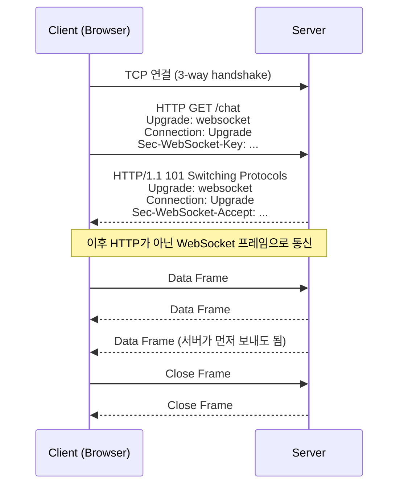
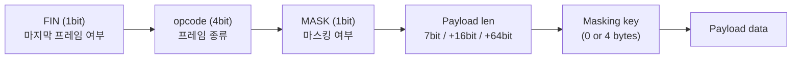

## 개요

WebSocket(RFC 6455)은 브라우저와 서버가 **하나의 TCP 연결 위에서 동시에 양방향(full-duplex)으로** 메시지를 주고받게 해 주는 프로토콜이다.

- 연결을 맺을 때(handshake)만 HTTP를 쓴다.
- handshake가 끝나면 HTTP를 더 이상 쓰지 않고, 같은 TCP 연결 위에서 WebSocket 고유의 프레임 형식으로 데이터를 주고받는다.
- 포트는 HTTP와 같은 80(`ws://`), 443(`wss://`)을 그대로 쓰므로 기존 웹 인프라(프록시, 방화벽)를 통과하기 쉽다.

HTTP는 요청이 있어야 응답이 오는 구조라 서버가 먼저 데이터를 보내려면 polling이나 long polling 같은 우회 방법이 필요했다. WebSocket은 연결을 한 번 열어 두고 양쪽이 아무 때나 메시지를 보낼 수 있어서 채팅, 실시간 알림, 대시보드, 게임처럼 지연이 중요한 서비스에 쓰인다.

## Handshake: HTTP에서 WebSocket으로 전환

프로토콜 전환에는 HTTP/1.1의 **Upgrade 메커니즘**을 쓴다. 클라이언트가 "이 연결을 websocket으로 바꾸자"고 요청하고, 서버가 `101 Switching Protocols`로 승낙하면 그 순간부터 같은 TCP 연결이 WebSocket 연결이 된다.



### 요청 예시 (RFC 6455)

```http
GET /chat HTTP/1.1
Host: server.example.com
Upgrade: websocket
Connection: Upgrade
Sec-WebSocket-Key: dGhlIHNhbXBsZSBub25jZQ==
Origin: http://example.com
Sec-WebSocket-Protocol: chat, superchat
Sec-WebSocket-Version: 13
```

### 응답 예시

```http
HTTP/1.1 101 Switching Protocols
Upgrade: websocket
Connection: Upgrade
Sec-WebSocket-Accept: s3pPLMBiTxaQ9kYGzzhZRbK+xOo=
Sec-WebSocket-Protocol: chat
```

### 주요 헤더

| 헤더 | 의미 |
| --- | --- |
| `Upgrade: websocket`, `Connection: Upgrade` | HTTP 연결을 다른 프로토콜(websocket)로 바꾸자는 요청과 승낙 |
| `Sec-WebSocket-Key` | 클라이언트가 매번 새로 만드는 16바이트 난수(Base64) |
| `Sec-WebSocket-Accept` | 서버가 Key로 계산해 돌려주는 값. 클라이언트는 이 값으로 자기 요청에 대한 정상 응답인지 확인한다 |
| `Sec-WebSocket-Protocol` | 그 위에서 쓸 애플리케이션 서브프로토콜(예: `chat`, `stomp`, `graphql-ws`) 협상 |
| `Sec-WebSocket-Version` | 프로토콜 버전. 현재는 `13` |

### Sec-WebSocket-Accept 계산

```text
Sec-WebSocket-Accept = Base64( SHA-1( Sec-WebSocket-Key + "258EAFA5-E914-47DA-95CA-C5AB0DC85B11" ) )
```

Key 문자열 뒤에 RFC에 고정된 GUID를 이어 붙이고, SHA-1 해시를 구한 뒤 Base64로 인코딩한다. 위 예시의 Key `dGhlIHNhbXBsZSBub25jZQ==`로 계산하면 `s3pPLMBiTxaQ9kYGzzhZRbK+xOo=`가 나온다.

```js
// Node.js로 확인
const crypto = require("crypto");
const key = "dGhlIHNhbXBsZSBub25jZQ==";
crypto.createHash("sha1").update(key + "258EAFA5-E914-47DA-95CA-C5AB0DC85B11").digest("base64");
// => 's3pPLMBiTxaQ9kYGzzhZRbK+xOo='
```

이 과정은 보안(암호화)을 위한 것이 아니다. WebSocket을 모르는 서버나 캐시가 잘못 응답한 것을 클라이언트가 걸러내기 위한 확인 절차다.

## 메시지와 Data Frame

handshake 후 주고받는 **메시지**는 하나 이상의 **프레임(frame)** 으로 나뉘어 전송된다. 프레임은 2~14바이트의 작은 헤더와 payload로 이루어진다.



| opcode | 종류 |
| --- | --- |
| `0x0` | 이어지는 프레임(continuation) |
| `0x1` | 텍스트(UTF-8) |
| `0x2` | 바이너리 |
| `0x8` | 연결 종료(Close) |
| `0x9` / `0xA` | Ping / Pong (연결 유지 확인) |

- **FIN**: 큰 메시지는 여러 프레임으로 나눠 보내고, 마지막 프레임에만 FIN=1을 붙인다.
- **Masking**: 클라이언트 → 서버 프레임은 반드시 4바이트 키로 마스킹해야 한다. 중간 프록시 캐시를 오염시키는 공격을 막기 위한 규칙이다. 서버 → 클라이언트 프레임은 마스킹하지 않는다.
- **Ping/Pong**: 연결이 살아 있는지 확인하고, 중간 장비의 유휴 타임아웃으로 연결이 끊기는 것을 막는 데 쓴다.
- **Close**: 한쪽이 Close 프레임을 보내면 상대도 Close로 응답한 뒤 TCP 연결을 닫는다.

## 정리

- 연결 수립은 **HTTP Upgrade**, 이후 통신은 **TCP 위의 WebSocket 프레임**으로 이루어진다.
- `Sec-WebSocket-Key`와 `Sec-WebSocket-Accept`는 상대가 WebSocket을 이해하는지 확인하는 장치이며, 암호화는 `wss://`(TLS)가 담당한다.
- 메시지는 FIN, opcode, MASK, 길이로 구성된 가벼운 프레임 단위로 오가므로 HTTP 요청마다 헤더를 반복하는 것보다 오버헤드가 작다.

## 참고

- [RFC 6455: The WebSocket Protocol](https://www.rfc-editor.org/rfc/rfc6455)
- [WebSocket - Wikipedia](https://en.wikipedia.org/wiki/WebSocket)
- [ssup2 Blog - WebSocket](https://ssup2.github.io/blog-software/docs/theory-analysis/websocket/) (정리 출발점)
